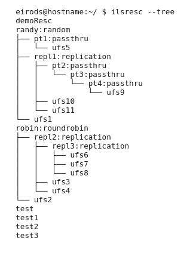

.. header:: iRODS TEMPLATE_IRODSVERSION - Manual
.. footer:: page ###Page###

.. |todaysdate| date::

|
|
|
|
|
|
|
|
|
|

.. figure:: ./iRODS/images/iRODS-Logo.png
   :width: 6 in
   :align: center

|
|
|
|
|
|
|

:Author: Renaissance Computing Institute (RENCI)
:Version: TEMPLATE_IRODSVERSION
:Date: |todaysdate|

.. contents:: Table of Contents
.. section-numbering::

.. raw:: pdf

   PageBreak

.. 
..   ----------------
..   ReStructuredText
..   ----------------
.. 
..   Needs python modules::
.. 
..    $ easy_install docutils==0.7.0
..    $ easy_install roman
..    $ easy_install reportlab
..    $ easy_install rst2pdf
.. 
..   Some links for learning in place:
.. 
..    http://docutils.sourceforge.net/docs/index.html
.. 
..    http://docutils.sourceforge.net/docs/user/rst/cheatsheet.txt
.. 
..    http://docutils.sourceforge.net/docs/user/rst/quickstart.txt
.. 
..    http://docutils.sourceforge.net/docs/user/rst/quickstart.html
.. 
..    http://docutils.sourceforge.net/docs/user/rst/demo.txt
.. 
..    http://docutils.sourceforge.net/docs/user/rst/demo.html
.. 
..    http://rst2pdf.googlecode.com/svn/trunk/doc/manual.txt
.. 
..   Generate HTML::
.. 
..    $ rst2html -stg manual.rst > manual.html
.. 
..   Generate PDF::
.. 
..    $ rst2pdf manual.rst -o manual.pdf

-------------
Release Notes
-------------

.. include:: RELEASE_NOTES

-------
License
-------

.. include:: LICENSE

--------
Overview
--------

This manual provides standalone documentation for iRODS (http://irods.org) as packaged by the Renaissance Computing Institute (RENCI) (http://www.renci.org) under the aegis of the iRODS Consortium (http://irods-consortium.org).  Please enter comments and suggestions as github issues at https://github.com/irods/irods/issues.

    http://irods.org

Additional documentation is available on the iRODS wiki (http://wiki.irods.org), the iRODS Doxygen site (http://irods.org/doxygen), and in the two books previously published by the iRODS team:

    (2010) iRODS Primer: integrated Rule-Oriented Data System (Synthesis Lectures on Information Concepts, Retrieval, and Services)
    http://www.amazon.com/dp/1608453332

    (2011) The integrated Rule-Oriented Data System (iRODS 3.0) Micro-service Workbook
    http://www.amazon.com/dp/1466469129

--------
Download
--------

iRODS is released in both binary package format and with full source code.

Binaries
--------

RPM and DEB formats are available for both iCAT-enabled servers and resource-only servers.  There are variations available for combinations of platform and operating system.

More combinations will be made available as our testing matrix continues to mature and increase in scope.

The latest files can be downloaded from http://irods.org/download.

Open Source
-----------

Repositories, issue trackers, and source code are available on GitHub.

  http://github.com/irods

  http://github.com/irods/irods

------------
Installation
------------

iRODS is provided in binary form in a collection of interdependent packages.  There are two flavors of iRODS server, iCAT and Resource.  An iCAT server, along with the iCAT metadata catalog, provide the nerve central for a data grid (Zone).  A resource server connects to an existing data grid, providing it with an additional data resource.  An iCAT server needs a database to be up and running in order to create the iCAT; a resource server needs a data grid (an iCAT server and metadata catalogue) to be up and running in order to connect and become a resource on that data grid or Zone.

iCAT Server
-----------

Before installing the iRODS software, install your database and create a user/role 'irods' with create privileges. This 'irods' account will be the admin user for your iCAT database. Create this role with the password you will use in setting up the iCAT database during the iRODS installation. 

The irods-icat package installs a service account and group named 'irods' and the iRODS binaries.

The additional database plugin is required and installs the dependencies for database connections and a short setup script that will prompt for database connection information and configure the server.

Installation of the iCAT DEB and PostgreSQL plugin DEB::

 $ (sudo) dpkg -i irods-icat-TEMPLATE_IRODSVERSION-64bit.deb irods-database-plugin-postgres-1.0.deb
 $ (sudo) apt-get -f install
 $ (sudo) su - irods

And then as the irods user::

 irods@hostname:~/ $ ./packaging/setup_database.sh

The `./packaging/setup_database.sh` script will ask for the following five pieces of information before starting the iRODS server:

1) Database Server's Hostname or IP
2) Database Port
3) Database Name
4) Database User
5) Database Password

This information will need to be consistent with your previous setup of your database.

Installing the MySQL database plugin will also require `Installing lib_mysqludf_preg`_.  These functions are required for the internal iRODS SQL which uses regular expressions.

Database Setup Example
**********************

Once the PostgreSQL database plugin has been installed, the following text will be displayed::

 =======================================================================

 iRODS Postgres Database Plugin installation was successful.

 To configure this plugin, the following prerequisites need to be met:
  - an existing database user (to be used by the iRODS server)
  - an existing database (to be used as the iCAT catalog)
  - permissions for existing user on existing database

 Please run the following setup script as the irods user:
   ./packaging/setup_database.sh

 =======================================================================

iRODS can use many different database configurations.  As an example, a local
PostgreSQL database can be configured on Ubuntu 12.04 with the following steps::

 $ (sudo) su - postgres
 postgres$ psql
 psql> CREATE USER irods WITH PASSWORD 'testpassword';
 psql> CREATE DATABASE "ICAT";
 psql> GRANT ALL PRIVILEGES ON DATABASE "ICAT" TO irods;

Confirmation of the permissions can be viewed with ``\l`` within the ``psql`` console::

 psql> \l
                                   List of databases
    Name    |  Owner   | Encoding |   Collate   |    Ctype    |   Access privileges
 -----------+----------+----------+-------------+-------------+-----------------------
  ICAT      | postgres | UTF8     | en_US.UTF-8 | en_US.UTF-8 | =Tc/postgres         +
            |          |          |             |             | postgres=CTc/postgres+
            |          |          |             |             | irods=CTc/postgres
 ...
 (N rows)

Resource Server
---------------

The irods-resource package installs a local service account and group named 'irods' and the iRODS binaries.

There are no required additional packages, but the administrator will need to run a short setup script that will prompt for iRODS connection information and configure the server.

Installation of the Resource RPM::

 - Make sure to read ./packaging/RPM_INSTALLATION_HOWTO.txt before trying to install the RPM package.
 $ (sudo) rpm -i irods-resource-TEMPLATE_IRODSVERSION-64bit-centos6.rpm
 $ (sudo) su - irods

And then as the irods user::

 irods@hostname:~/ $ ./packaging/setup_resource.sh

The `./packaging/setup_resource.sh` script will ask for the following five pieces of information about the existing data grid that the iRODS resource server will need in order to start up and connect to its configured iCAT Zone:

1) iCAT Hostname or IP
2) iCAT Port
3) iCAT Zone 
4) iRODS administrator username
5) iRODS administrator password

Default Environment
-------------------

Once a server is up and running, the default environment can be shown::

 irods@hostname:~/ $ ienv
 NOTICE: Release Version = rodsTEMPLATE_IRODSVERSION, API Version = d
 NOTICE: irodsHost=hostname
 NOTICE: irodsPort=1247
 NOTICE: irodsDefResource=demoResc
 NOTICE: irodsHome=/tempZone/home/rods
 NOTICE: irodsCwd=/tempZone/home/rods
 NOTICE: irodsUserName=rods
 NOTICE: irodsZone=tempZone
 NOTICE: irodsClientServerNegotiation=request_server_negotiation
 NOTICE: irodsClientServerPolicy=CS_NEG_REFUSE
 NOTICE: irodsEncryptionKeySize=32
 NOTICE: irodsEncryptionSaltSize=8
 NOTICE: irodsEncryptionNumHashRounds=16
 NOTICE: irodsEncryptionAlgorithm=AES-256-CBC
 NOTICE: irodsDefaultHashScheme=SHA256

Run In Place
------------

iRODS can be compiled from source and run from the same directory.  Although this is not recommended for production deployment, it may be useful for testing, running multiple iRODS servers on the same system, running iRODS on systems without a package manager, and users who do not have administrator rights on their system.

To run iRODS in place, the build script must be called with the appropriate flag::

 user@hostname:~/irods/ $ ./packaging/build.sh --run-in-place icat postgres

After the system is built, the setup_database.sh script needs to be run from its original location::

 user@hostname:~/irods/ $ ./plugins/database/packaging/setup_database.sh

The script will prompt for iRODS configuration information that would already be known to a binary installation::

 ===================================================================

 You are installing iRODS with the --run-in-place option.

 The iRODS server cannot be started until it has been configured.

 iRODS server's port [1247]: 

 iRODS port range (begin) [20000]: 

 iRODS port range (end) [20199]: 

 iRODS Vault directory [/full/path/to/Vault]: 

 iRODS server's adminstrator name [rods]: 

 iRODS server's administrator password: 

 -------------------------------------------
 iRODS Port:             1247
 Range (Begin):          20000
 Range (End):            20199
 Vault Directory:        /full/path/to/Vault
 Administrator Name:     rods
 Administrator Password: Not Shown
 -------------------------------------------
 Please confirm these settings [yes]: 

MacOSX
******

Installation on a MacOSX system requires the use of the --run-in-place build option due to the lack of a system-level package manager.

.. include:: packaging/MACOSX_DATABASE_SETUP.txt

----------
Quickstart
----------

Successful installation will complete and result in a running iRODS server.  The iCommand ``ils`` will list your new iRODS administrator's empty home directory in the iRODS virtual filesystem::

 irods@hostname:~/ $ ils
 /tempZone/home/rods:

When moving into production, you should cover the following steps as best practice:

Changing the administrator account password
-------------------------------------------

The default installation of iRODS comes with a single user account 'rods' that is also an admin account ('rodsadmin') with the password 'rods'.  You should change the password before letting anyone else into the system::

 irods@hostname:~/ $ iadmin moduser rods password <newpassword>

To make sure everything succeeded, you will need to re-authenticate and check the new connection::
 
 irods@hostname:~/ $ iinit
 Enter your current iRODS password:
 irods@hostname:~/ $ ils
 /tempZone/home/rods:

If you see an authentication or other error message here, please try again.  The password update only manipulates a single database value, and is independent of other changes to the system.

Changing the Zone name
----------------------

The default installation of iRODS comes with a Zone named 'tempZone'.  You probably want to change the Zone name to something more domain-specific::

 irods@hostname:~/ $ iadmin modzone tempZone name <newzonename>
 If you modify the local zone name, you and other users will need to
 change your .irodsEnv files to use it, you may need to update
 /etc/irods/irods.config and, if rules use the zone name, you'll need to update
 /etc/irods/core.re.  This command will update various tables with the new name
 and rename the top-level collection.
 Do you really want to modify the local zone name? (enter y or yes to do so):y
 OK, performing the local zone rename
 
Once the Zone has been renamed, you will need to update your .irodsEnv file to match (note the three places where the updated zone name is located)::

 irods@hostname:~/ $ cat .irods/.irodsEnv
 # iRODS server host name:
 irodsHost '<hostname>'
 # iRODS server port number:
 irodsPort 1247
 # Default storage resource name:
 irodsDefResource 'demoResc'
 # Home directory in iRODS:
 irodsHome '/**<newzonename>**/home/rods'
 # Current directory in iRODS:
 irodsCwd '/**<newzonename>**/home/rods'
 # Account name:
 irodsUserName 'rods'
 # Zone:
 irodsZone '**<newzonename>**'
 # Enable Advanced Client-Server negotation:
 irodsClientServerNegotiation 'request_server_negotiation'
 # Client-Server connection policy:
 irodsClientServerPolicy 'CS_NEG_REFUSE'
 # Client-Server Encryption Key Size In Bytes:
 irodsEncryptionKeySize '32'
 # Client-Server Encryption Salt Size In Bytes:
 irodsEncryptionSaltSize '8'
 # Client-Server Encryption Number of Hash Rounds:
 irodsEncryptionNumHashRounds '16'
 # Client-Server Encryption Algorithm:
 irodsEncryptionAlgorithm 'AES-256-CBC'
 # Client requested hash scheme:
 irodsDefaultHashScheme 'SHA256'
 # Hash Matching Policy:
 #irodsMatchHashPolicy 'strict'

Now, the connection should be reset and you should be able to list your empty iRODS collection again::

 irods@hostname:~/ $ iinit
 Enter your current iRODS password:
 irods@hostname:~/ $ ils
 /<newzonename>/home/rods:

Add additional resource(s)
--------------------------

The default installation of iRODS comes with a single resource named 'demoResc' which stores its files in the `/var/lib/irods/iRODS/Vault` directory.  You will want to create additional resources at disk locations of your choosing as the 'demoResc' may not have sufficient disk space available for your intended usage scenarios.  The following command will create a basic 'unixfilesystem' resource at a designated host at the designated full path::

 irods@hostname:~/ $ iadmin mkresc <newrescname> 'unixfilesystem' <fully.qualified.domain.name>:</full/path/to/new/vault>
 
Additional information about creating resources can be found with::

 irods@hostname:~/ $ iadmin help mkresc
  mkresc Name Type [Host:Path] [ContextString] (make Resource)
 Create (register) a new storage or database resource.

 Name is the name of the new resource.
 Type is the resource type.
 Host is the DNS host name.
 And Path is the defaultPath for the vault.
 ContextString is any contextual information relevant to this resource.
   (semi-colon separated key=value pairs e.g. "a=b;c=d")

 A ContextString can be added to a coordinating resource (where there is
 no hostname or vault path to be set) by explicitly setting the Host:Path
 to an empty string ('').

Creating new resources does not make them default for any existing or new users.  You will need to make sure that default resources are properly set for newly ingested files.

Change default resource name and/or path
----------------------------------------

Installing an iRODS resource server gives you a default resource name of <hostname>Resource and default data path of /var/lib/irods/iRODS/<hostname>ResourceVault on the local resource. These can both be changed, using modresc, a part of the iadmin command available to administrative users. Follow the indications given in 'iadmin -h'.  For simplicity's sake, such modifications should generally take place before any data has been placed in the default resource at the default location.

Add additional user(s)
----------------------

The default installation of iRODS comes with a single user 'rods' which is a designated 'rodsadmin' type user account.  You will want to create additional user accounts (of type 'rodsuser') and set their passwords before allowing connections to your new grid::

 irods@hostname:~/ $ iadmin mkuser <newusername> rodsuser

 irods@hostname:~/ $ iadmin lu
 rods#tempZone
 <newusername>#tempZone
 
 irods@hostname:~/ $ iadmin help mkuser
  mkuser Name[#Zone] Type (make user)
 Create a new iRODS user in the ICAT database

 Name is the user name to create
 Type is the user type (see 'lt user_type' for a list)
 Zone is the user's zone (for remote-zone users)

 Tip: Use moduser to set a password or other attributes,
 use 'aua' to add a user auth name (GSI DN or Kerberos Principal name)

It is best to change your Zone name before adding new users as any existing users would need to be informed of the new connection information and changes that would need to be made to their local .irodsEnv files.

---------
Upgrading
---------

Upgrading is handled by the host Operating System via the package manager.

RPM based systems
-----------------

 $ (sudo) rpm -U irods-icat-TEMPLATE_IRODSVERSION-64bit-suse.rpm

DEB based systems
-----------------

 $ (sudo) dpkg -i irods-icat-TEMPLATE_IRODSVERSION-64bit.deb

From E-iRODS 3.0.1
------------------

Upgrading from E-iRODS to iRODS 4.0+ is not currently supported with an automatic script.  Since the package names, the default database, the service account, and the home directory were all changed, it was decided that there were too many moving parts (and too many possible combinations) to successfully detect and manipulate into a functional 4.0+ installation.

If you are in need of upgrading from a production E-iRODS 3.0.1 installation, please contact the iRODS team at RENCI for free support.

From iRODS 3.3.x
----------------

.. role:: rubric

Upgrading from iRODS 3.3.x to iRODS 4.0+ is not supported with an automatic script.  There is no good way to automate setting the new configuration options (resource hierarchies, server.config, etc.) based solely on the state of a 3.3.x system.  In addition, with some of the new functionality, a system administrator may choose to implement some existing policies in a different manner with 4.0+.

:rubric:`For these reasons, the following manual steps should be carefully studied and understood before beginning the upgrade process.`

#. Port any custom development to plugins: Microservices, Resources, Authentication
#. Make a backup of the iCAT database & configuration files: core.re, core.fnm, core.dvm, etc.
#. Declare a Maintenance Window
#. Remove resources from resource groups
#. Remove resource groups (confirm: ``iadmin lrg`` returns no results)
#. Shutdown 3.3.x server(s)
#. If necessary, start 3.3.x in-place iCAT database ( ``irodsctl dbstart`` )
#. Install iRODS 4.0+ packages: irods-icat and a database plugin package (e.g. irods-database-plugin-postgres)
#. Patch database with provided upgrade SQL file ( psql ICAT < `packaging/upgrade-3.3.xto4.0.0.sql` )
#. If necessary, migrate 3.3.x in-place iCAT database to the system database installation.  It is recommended to dump and restore your database into the system installation.  This will allow the original database to be uninstalled completely, once the iRODS upgrade is confirmed.
#. Provide a database user 'irods', database password, and owner permissions for that database user to the new system-installed iCAT.
#. Confirm all local at-rest data (any local iRODS Vault paths) has read and write permissions for the new 'irods' unix service account.
#. Manually update any changes to 'core.re' and 'server.config'.  Keep in mind immediate replication rules (``acPostProcForPut``, etc.) may be superceded by your new resource composition.
#. Run ``./packaging/setup_database.sh`` (recommended) OR Manually update all 4.0+ configuration files given previous 3.3.x configuration (.irodsEnv, .odbc.ini DSN needs to be set to either 'postgres', 'mysql', or 'oracle').  The automatic ``./packaging/setup_database.sh`` script will work only with the system-installed database server.
#. Start new 4.0+ iCAT server
#. On all resource servers in the same Zone, install and setup 4.0+.  Existing configuration details should be ported as well ('server.config', 'core.re', Vault permissions).
#. Rebuild Resource Hierarchies from previous Resource Group configurations (``iadmin addchildtoresc``) (See `Composable Resources`_)
#. Install Custom Plugins (Microservice & Resources)
#. Conformance Testing
#. Sunset 3.3.x server(s)
#. Close Maintenance Window

---------------------
Server Authentication
---------------------

Within A Zone
-------------

When a client connects to a resource server and then authenticates, the resource server connects to the iCAT server to perform the authentication. To make this more secure, you can configure some Server Identifiers (SIDs) to cause the iRODS system to authenticate the servers themselves. These SID passwords should be unique and arbitrary strings, one for your whole zone::

 LocalZoneSID  SomeChosenIDString

This allows the resource server to verify the identity of the iCAT server beyond just relying on DNS. If you do not set up the LocalZoneSID, the log on the resource server will contain warnings like these::

 Warning, cannot authenticate remote server, serverResponse field is empty

However, the authentication will be allowed.

For 3.3.1+, if LocalZoneSID is defined, the authentication will not be allowed if the remote server fails to authenticate itself. In 3.3.1+, you will get the following if LocalZoneSID is not set::

 Warning, cannot authenticate the remote server, no RemoteZoneSID defined in server.config

Mutual authentication between servers is always on.  Note that this applies to iRODS passwords and PAM, and some other interactions, but not GSI or Kerberos. 

For GSI, users can set the `irodsServerDn` variable to do mutual authentication.

Between Two Zones
-----------------

When a user from a remote zone connects to the local zone, the iRODS server will check with the iCAT in the user's home zone to authenticate the user (confirm their password). This works well, as no user passwords have to be exchanged between zones and it is simple and easy to administer. But it is secure only if it is actually connecting to the correct host computer. And that relies on DNS which can be compromised.

To make this more secure, you can configure some Server Identifiers (SIDs) to cause the iRODS system to authenticate the servers, via something like the iRODS password mechanism (using an MD5 hash). These SID passwords should be unique and arbitrary strings, one for each zone.

To configure this, add items to the `/etc/irods/server.config` file. 'LocalZoneSID' is for the local zone SID, for example::

 LocalZoneSID  qwerty123

And one or more 'RemoteZoneSID' items for the remote zones, for example::

 RemoteZoneSID <ZoneName>-<LocalZoneSID> ( e.g tempZone-qwerty123 )

When tempZone users connect, the system will then confirm that tempZone's LocalZoneSID is 'qwerty123' (via a hash, no password on the network).

Mutual authentication between servers is always on across Federations.

If you want, you can also scramble the SIDs in the /etc/irods/server.config file. Use the 'iadmin spass' to scramble and enter the key used in the server.config file:

  SIDKey 456

This makes it a little more secure by keeping plain text passwords (although not encrypted) out of text files on your host.

-------------------------
Federation with iRODS 3.x
-------------------------

iRODS 4.0+ has made some additions to the database tables for the resources (r_resc_main) and Data Objects (r_data_main) for the purposes of tracking resource hierarchy, children, parents, and other relationships.  These changes would have caused a cross-zone query to fail when the target zone is iRODS 3.x.

In order to support commands such as ``ils`` and ``ilsresc`` across a 3.x to 4.0+ federation, iRODS 4.0+ will detect the cross zone query and subsequently strip out any requests for columns which do not exist in the iRODS 3.x table structure in order to allow the query to succeed.

There are currently no known issues with Federation, but this has not yet been comprehensively tested.

.irodsEnv for Service Account
-----------------------------

irodsClientServerNegotiation needs to be commented out (turned off) as 3.x does not support this feature.

The effect of turning this negotiation off is a lack of SSL encryption when talking with a 3.x Zone.  All clients that connect to this 4.0+ Zone will also need to disable the Advanced Negotiation in their own '.irodsEnv' files.

----------
Backing Up
----------

Backing up iRODS involves: The data, the iRODS system and configuration files, and the iCAT database itself.

Configuration and maintenance of this type of backup system is out of scope for this document, but is included here as an indication of best practice.

1) The data itself can be handled by the iRODS system through replication and should not require any specific backup efforts worth noting here.

2) The iRODS system and configuration files can be copied into iRODS as a set of Data Objects by using the `msiServerBackup` microservice.  When run on a regular schedule, the `msiServerBackup` microservice will gather and store all the necessary configuration information to help you reconstruct your iRODS setup during disaster recovery.

3) The iCAT database itself can be backed up in a variety of ways.  A PostgreSQL database is contained on the local filesystem as a data/ directory and can be copied like any other set of files.  This is the most basic means to have backup copies.  However, this will have stale information almost immediately.  To cut into this problem of staleness, PostgreSQL 8.4+ includes a feature called `"Record-based Log Shipping"`__.  This consists of sending a full transaction log to another copy of PostgreSQL where it could be "re-played".  This would bring the copy up to date with the originating server.  Log shipping would generally be handled with a cronjob.  A faster, seamless version of log shipping called `"Streaming Replication"`__ was included in PostgreSQL 9.0+ and can keep two PostgreSQL servers in sync with sub-second delay.

.. __: http://www.postgresql.org/docs/8.4/static/warm-standby.html#WARM-STANDBY-RECORD
.. __: http://www.postgresql.org/docs/9.0/static/warm-standby.html#STREAMING-REPLICATION

------------
Architecture
------------

iRODS 4.0+ represents a major effort to analyze, harden, and package iRODS for sustainability, modularization, security, and testability.  This has led to a fairly significant refactorization of much of the underlying codebase.  The following descriptions are included to help explain the architecture of iRODS.

The core is designed to be as immutable as possible and serve as a bus for handling the internal logic of the business of iRODS (data storage, policy enforcement, etc.).  Seven or eight major interfaces will be exposed by the core and will allow extensibility and separation of functionality into plugins.  A few plugins are included by default in iRODS to provide a set of base functionality.

The planned plugin interfaces and their status are listed here:

 =============================    ==========    ========
 Plugin Interface                 Status        Since
 =============================    ==========    ========
 Pluggable Microservices          Complete      3.0b2
 Composable Resources             Complete      3.0b3
 Pluggable Authentication         Complete      3.0.1b1
 Pluggable Network                Complete      3.0.1b1
 Pluggable Database               Complete      4.0.0b1
 Pluggable RPC API                Complete      4.0.0b2
 Pluggable First Class Objects    Requested
 Pluggable Rule Engine            Requested
 =============================    ==========    ========

Dynamic Policy Enforcement Points
---------------------------------

iRODS 4.0+ has introduced the capability for dynamic policy enforcement points (PEP).  For every operation that is called, two policy enforcement points are constructed (both a pre and post variety), and if it has been defined in core.re or any other loaded rulebase file they will be executed by the rule engine.

The PEP will be constructed of the form "pep_PLUGINOPERATION_pre" and "pep_PLUGINOPERATION_post".

For example, for "resource_create", the two PEPs that are dynamically evaluated are pep_resource_create_pre(\*OUT) and pep_resource_create_post(\*OUT).  If either or both have been defined in a loaded rulebase file (core.re), they will be executed as appropriate.

The flow of information from the pre PEP to the plugin operation to the post PEP works as follows:

- pep_PLUGINOPERATION_pre(\*OUT) - Should produce an \*OUT variable that will be passed to the calling plugin operation
- PLUGINOPERATION - Will receive any \*OUT defined by pep_PLUGINOPERATION_pre(\*OUT) above and will pass its own \*OUT variable to pep_PLUGINOPERATION_post()
- pep_PLUGINOPERATION_post() - Will receive any \*OUT from PLUGINOPERATION.  If the PLUGINOPERATION itself failed, the \*OUT variable will be populated with the string "OPERATION_FAILED".

Available Plugin Operations
***************************

The following operations are available for dynamic PEP evaluation.  At this time, only very few operations themselves consider the output (\*OUT) of its associated pre PEP.

 +-------------------------+-----------------------------------+
 | Plugin Type             | Plugin Operation                  |
 +=========================+===================================+
 |                         |                                   |
 | Resource                |  resource_create                  |
 |                         |                                   |
 |                         |  resource_open                    |
 |                         |                                   |
 |                         |  resource_read                    |
 |                         |                                   |
 |                         |  resource_write                   |
 |                         |                                   |
 |                         |  resource_stagetocache            |
 |                         |                                   |
 |                         |  resource_synctoarch              |
 |                         |                                   |
 |                         |  resource_registered              |
 |                         |                                   |
 |                         |  resource_unregistered            |
 |                         |                                   |
 |                         |  resource_modified                |
 |                         |                                   |
 |                         |  resource_resolve_hierarchy       |
 |                         |                                   |
 |                         |  resource_rebalance               |
 |                         |                                   |
 +-------------------------+-----------------------------------+
 |                         |                                   |
 | Authentication          |  auth_client_start                |
 |                         |                                   |
 |                         |  auth_agent_start                 |
 |                         |                                   |
 |                         |  auth_establish_context           |
 |                         |                                   |
 |                         |  auth_agent_client_request        |
 |                         |                                   |
 |                         |  auth_agent_auth_request          |
 |                         |                                   |
 |                         |  auth_agent_client_response       |
 |                         |                                   |
 |                         |  auth_agent_auth_response         |
 |                         |                                   |
 |                         |  auth_agent_auth_verify           |
 |                         |                                   |
 +-------------------------+-----------------------------------+
 |                         |                                   |
 | Network                 |  network_client_start             |
 |                         |                                   |
 |                         |  network_client_stop              |
 |                         |                                   |
 |                         |  network_agent_start              |
 |                         |                                   |
 |                         |  network_agent_stop               |
 |                         |                                   |
 |                         |  network_read_header              |
 |                         |                                   |
 |                         |  network_read_body                |
 |                         |                                   |
 |                         |  network_write_header             |
 |                         |                                   |
 |                         |  network_write_body               |
 |                         |                                   |
 +-------------------------+-----------------------------------+

Available Values within Dynamic PEPs
************************************

The following Key-Value Pairs are made available within the running context of each dynamic policy enforcement point (PEP) based both on the plugin type as well as the first class object of interest.  They are available via the rule engine in the form of ``$KVPairs.VARIABLE_NAME`` and are originally defined in `iRODS/lib/core/include/rodsKeyWdDef.h`.

 +----------------+---------------------+-------------------------+
 | Plugin Type    | First Class Object  | Variable Name           |
 +================+=====================+=========================+
 |                |                     |                         |
 | Resource       | Data Object         | physical_path           |
 |                |                     |                         |
 |                |                     | mode_kw                 |
 |                |                     |                         |
 |                |                     | flags_kw                |
 |                |                     |                         |
 |                |                     | resc_hier               |
 |                |                     |                         |
 |                +---------------------+-------------------------+
 |                |                     |                         |
 |                | File Object         | logical_path            |
 |                |                     |                         |
 |                |                     | file_descriptor         |
 |                |                     |                         |
 |                |                     | l1_desc_idx             |
 |                |                     |                         |
 |                |                     | file_size               |
 |                |                     |                         |
 |                |                     | repl_requested          |
 |                |                     |                         |
 |                |                     | in_pdmo                 |
 |                |                     |                         |
 |                +---------------------+-------------------------+
 |                |                     |                         |
 |                | Structured Object   | host_addr               |
 |                |                     |                         |
 |                |                     | zone_name               |
 |                |                     |                         |
 |                |                     | port_num                |
 |                |                     |                         |
 |                |                     | sub_file_path           |
 |                |                     |                         |
 |                |                     | offset                  |
 |                |                     |                         |
 |                |                     | dataType                |
 |                |                     |                         |
 |                |                     | oprType                 |
 |                |                     |                         |
 |                +---------------------+-------------------------+
 |                |                     |                         |
 |                | Special Collection  | spec_coll_class         |
 |                |                     |                         |
 |                |                     | spec_coll_type          |
 |                |                     |                         |
 |                |                     | spec_coll_obj_path      |
 |                |                     |                         |
 |                |                     | spec_coll_resource      |
 |                |                     |                         |
 |                |                     | spec_coll_resc_hier     |
 |                |                     |                         |
 |                |                     | spec_coll_phy_path      |
 |                |                     |                         |
 |                |                     | spec_coll_cache_dir     |
 |                |                     |                         |
 |                |                     | spec_coll_cache_dirty   |
 |                |                     |                         |
 |                |                     | spec_coll_repl_num      |
 |                |                     |                         |
 +----------------+---------------------+-------------------------+
 |                |                     |                         |
 | Authentication |  Native Password    |  zone_name              |
 |                |                     |                         |
 |                |  OS Auth            |  user_name              |
 |                |                     |                         |
 |                |  PAM                |  digest                 |
 |                |                     |                         |
 +----------------+---------------------+-------------------------+
 |                |                     |                         |
 | Network        | TCP                 |  tcp_socket_handle      |
 |                |                     |                         |
 |                +---------------------+-------------------------+
 |                |                     |                         |
 |                | SSL                 |  ssl_host               |
 |                |                     |                         |
 |                |                     |  ssl_shared_secret      |
 |                |                     |                         |
 |                |                     |  ssl_key_size           |
 |                |                     |                         |
 |                |                     |  ssl_salt_size          |
 |                |                     |                         |
 |                |                     |  ssl_num_hash_rounds    |
 |                |                     |                         |
 |                |                     |  ssl_algorithm          |
 |                |                     |                         |
 +----------------+---------------------+-------------------------+

For example, within a PEP, you could reference $KVPairs.file_size and get the size of the file currently in context.  Likewise, $KVPairs.ssl_host would provide the current hostname involved in an SSL connection.

Also, $pluginInstanceName is an additional available session variable that gives the instance name of the plugin from which the call is made.

For example, when running ``iput -R myOtherResc newfile.txt``, a ``fileCreate()`` operation is called on "myOtherResc".  This delegates the call to the myOtherResc plugin instance which is a "resource_create" operation.  When the pep_resource_create_pre() rule is evaluated, the value of $pluginInstanceName will be "myOtherResc".  This allows rule authors to make decisions at a per-resource basis for this type of operation.

-----------------------
Pluggable Microservices
-----------------------

iRODS is in the process of being modularized whereby existing iRODS 3.x functionality will be replaced and provided by small, interoperable plugins.  The first plugin functionality to be completed was pluggable microservices.  Pluggable microservices allow users to add new microservices to an existing iRODS server without recompiling the server or even restarting any running processes.  A microservice plugin contains a single compiled microservice shared object file to be found by the server.  Development examples can be found in the source tree under `examples/microservices`_.

.. _examples/microservices: https://github.com/irods/irods/tree/master/examples/microservices

A separate development package, irods-dev, available at http://irods.org/download, contains the necessary header files to write your own microservice plugins (as well as any other type of iRODS plugin).  Additional information can be found in the `Microservice Developers Tutorial`_. 

.. _Microservice Developer Tutorial: https://github.com/irods/irods/blob/master/examples/microservices/microservice_tutorial.rst

--------------------
Composable Resources
--------------------

The second area of modularity to be added to iRODS 4.0+ consists of composable resources.  Composable resources replace the concept of resource groups from iRODS 3.x.  There are no resource groups in iRODS 4.0+. 

Tree Metaphor
-------------

In computer science, a tree is a data structure with a hierarchical representation of linked nodes. These nodes can be named based on where they are in the hierarchy. The node at the top of a tree is the root node. Parent nodes and child nodes are on opposite ends of a connecting link, or edge. Leaf nodes are at the bottom of the tree, and any node that is not a leaf node is a branch node. These positional descriptors are helpful when describing the structure of a tree. Composable resources are best represented using this tree metaphor.

An iRODS composite resource is a tree with one 'root' node.  Nodes that are at the bottom of the tree are 'leaf' nodes.  Nodes that are not leaf nodes are 'branch' nodes and have one or more 'child' nodes.  A child node can have one and only one 'parent' node.

The terms root, leaf, branch, child, and parent represent locations and relationships within the structure of a particular tree.  To represent the functionality of a particular resources within a particular tree, the terms 'coordinating' and 'storage' are used in iRODS.  Coordinating resources coordinate the flow of data to and from other resources.  Storage resources are typically 'leaf' nodes and handle the direct reading and writing of data through a POSIX-like interface.

Any resource node can be a coordinating resource and/or a storage resource.  However, for clarity and reuse, it is generally best practice to separate the two so that a particular resource node is either a coordinating resource or a storage resource.

This powerful tree metaphor is best illustrated with an actual example.  You can now use `ilsresc --tree` to visualize the tree structure of a grid.

Virtualization
--------------

In iRODS, files are stored as Data Objects on disk and have an associated physical path as well as a virtual path within the iRODS file system. iRODS collections, however, only exist in the iCAT database and do not have an associated physical path (allowing them to exist across all resources, virtually).

Composable resources, both coordinating and storage, introduce the same dichotomy between the virtual and physical.  A coordinating resource has built-in logic that defines how it determines, or coordinates, the flow of data to and from its children. Coordinating resources exist solely in the iCAT and exist virtually across all iRODS servers in a particular Zone. A storage resource has a Vault (physical) path and knows how to speak to a specific type of storage medium (disk, tape, etc.). The encapsulation of resources into a plugin architecture allows iRODS to have a consistent interface to all resources, whether they represent coordination or storage.

This virtualization enables the coordinating resources to manage both the placement and the retrieval of Data Objects independent from the types of resources that are connected as children resources. When iRODS tries to retrieve data, each child resource will "vote", indicating whether it can provide the requested data.  Coordinating resources will then decide which particular storage resource (e.g. physical location) the read should come from. The specific manner of this vote is specific to the logic of the coordinating resource.  A coordinating resource may lean toward a particular vote based on the type of optimization it deems best. For instance, a coordinating resource could decide between child votes by opting for the child that will reduce the number of requests made against each storage resource within a particular time frame or opting for the child that reduces latency in expected data retrieval times. We expect a wide variety of useful optimizations to be developed by the community.

An intended side effect of the tree metaphor and the virtualization of coordinating resources is the deprecation of the concept of a resource group. Resource groups in iRODS 3.x could not be put into other resource groups. A specific limiting example is a compound resource that, by definition, was a group and could not be placed into another group.  This significantly limited its functionality as a management tool. Groups in iRODS now only refer to user groups.

Read more about Composable Resources at `http://irods.org/2013/02/e-irods-composable-resources/`__:

- `Paper (279kB, PDF)`__
- `Slides (321kB, PDF)`__
- `Poster (6.4MB, PDF)`__

.. __: http://irods.org/2013/02/e-irods-composable-resources/
.. __: http://irods.org/dev/wp-content/uploads/2013/02/eirods-composable-resources.pdf
.. __: http://irods.org/dev/wp-content/uploads/2013/02/eirods-cr-slides.pdf
.. __: http://irods.org/dev/wp-content/uploads/2013/02/eirods-composable-resources-poster.pdf

Coordinating Resources
----------------------

Coordinating resources contain the flow control logic which determines both how its child resources will be allocated copies of data as well as which copy is returned when a Data Object is requested.  There are several types of coordinating resources: compound, random, replication, round robin, passthru, and some additional types that are expected in the future.  Each is discussed in more detail below.

Compound
********

The compound resource is a continuation of the legacy compound resource type from iRODS 3.x.

A compound resource has two and only two children.  One must be designated as the 'cache' resource and the other as the 'archive' resource.  This designation is made in the "context string" of the ``addchildtoresc`` command.

An Example::

 irods@hostname:~/ $ iadmin addchildtoresc parentResc newChildResc1 cache
 irods@hostname:~/ $ iadmin addchildtoresc parentResc newChildResc2 archive

Putting files into the compound resource will first create a replica on the cache resource and then create a second replica on the archive resource.

Getting files from the compound resource will behave in a similar way as iRODS 3.x.  By default, the replica from the cache resource will always be returned.  If the cache resource does not have a copy, then a replica is created on the cache resource before being returned.

This compound resource staging policy can be controlled with the policy key-value pair whose keyword is "compound_resource_cache_refresh_policy" and whose values are either "when_necessary" (default), or "always".

From the example near the bottom of the core.re rulebase::

 # =-=-=-=-=-=-=-
 # policy controlling when a dataObject is staged to cache from archive in a compound coordinating resource
 #  - the default is to stage when cache is not present ("when_necessary")
 # =-=-=-=-=-=-=-
 # pep_resource_resolve_hierarchy_pre(*OUT){*OUT="compound_resource_cache_refresh_policy=when_necessary";}  # default
 # pep_resource_resolve_hierarchy_pre(*OUT){*OUT="compound_resource_cache_refresh_policy=always";}

Replicas within a compound resource can be trimmed.  There is no rebalance activity defined for a compound resource.  When the cache fills up, the administrator will need to take action as they see fit.  This may include physically moving files to other resources, commissioning new storage, or marking certain resources "down" in the iCAT.

The "--purgec" option for ``iput``, ``iget``, and ``irepl`` is honored and will always purge the first replica (usually with replica number 0) for that Data Object (regardless of whether it is held within this compound resource).  This is not an optimal use of the compound resource as the behavior will become somewhat nondeterministic with complex resource compositions.

Deferred
********

The deferred resource is designed to be as simple as possible.  A deferred resource can have one or more children.

A deferred resource provides no implicit data management policy.  It defers to its children with respect to routing both puts and gets.  However they vote, the deferred node decides.

Load Balanced
*************

The load balanced resource provides equivalent functionality as the "doLoad" option for the `msiSetRescSortScheme` microservice.  This resource plugin will query the r_server_load_digest table from the iCAT and select the appropriate child resource based on the load values returned from the table.

The r_server_load_digest table is part of the Resource Monitoring System and has been incorporated into iRODS 4.x.  The r_server_load_digest table must be populated with load data for this plugin to function properly.

The load balanced resource has an effect on writes only (it has no effect on reads).

Random
******

The random resource provides logic to put a file onto one of its children on a random basis.  A random resource can have one or more children.

If the selected target child resource of a put operation is currently marked "down" in the iCAT, the random resource will move on to another random child and try again.  The random resource will try each of its children, and if still not succeeding, throw an error.

Replication
***********

The replication resource provides logic to automatically manage replicas to all its children.

`Rebalancing`_ of the replication node is made available via the "rebalance" subcommand of ``iadmin``.  For the replication resource, all Data Objects on all children will be replicated to all other children.  The amount of work done in each iteration as the looping mechanism completes is controlled with the session variable ``replication_rebalance_limit``.  The default value is set at 500 Data Objects per loop.

Getting files from the replication resource will show a preference for locality.  If the client is connected to one of the child resource servers, then that replica of the file will be returned, minimizing network traffic.

Round Robin
***********

The round robin resource provides logic to put a file onto one of its children on a rotating basis.  A round robin resource can have one or more children.

If the selected target child resource of a put operation is currently marked "down" in the iCAT, the round robin resource will move onto the next child and try again.  If all the children are down, then the round robin resource will throw an error.

Passthru
********

The passthru resource was originally designed as a testing mechanism to exercise the new composable resource hierarchies.

A passthru resource can have one and only one child.

Expected
********

A few other coordinating resource types have been brainstormed but are not functional at this time:

 - Storage Balanced (%-full) (expected)
 - Storage Balanced (bytes) (expected)
 - Tiered (expected)

Storage Resources
-----------------

Storage resources represent storage interfaces and include the file driver information to talk with different types of storage.

Unix File System
****************

The unix file system storage resource is the default resource type that can communicate with a device through the standard POSIX interface.

Structured File Type (tar, zip, gzip, bzip)
*******************************************

The structured file type storage resource is used to interface with files that have a known format.  By default these are used "under the covers" and are not expected to be used directly by users (or administrators).

These are used mainly for mounted collections.

Amazon S3 (Archive)
*******************

The Amazon S3 archive storage resource is used to interface with an S3 bucket.  It is expected to be used as the archive child of a compound resource composition.  The credentials are stored in a file which is referenced by the context string.  Read more at: https://github.com/irods/irods_resource_plugin_s3

DDN WOS (Archive)
*****************

The DataDirect Networks (DDN) WOS archive storage resource is used to interface with a Web Object Scalar (WOS) Appliance.  It is expected to be used as the archive child of a compound resource composition.  It currently references a single WOS endpoint and WOS policy in the context string.  Read more at: https://github.com/irods/irods_resource_plugin_wos

Non-Blocking
************

The non-blocking storage resource behaves exactly like the standard unix file system storage resource except that the "read" and "write" operations do not block (they return immediately while the read and write happen independently).

Mock Archive
************

The mock archive storage resource was created mainly for testing purposes to emulate the behavior of object stores (e.g. WOS).  It creates a hash of the file path as the physical name of the Data Object.

Direct Access
*************

The direct access resource was created for scenarios where data resources need to be accessible both through iRODS and through the local filesystem. A typical usage scenario would be an environment in which there is a shared high performance filesystem mounted on a compute cluster via NFS, and on which iRODS has the files from this filesystem registered in order to provide metadata annotation for the files in this filesystem (i.e. iRODS acts as an "overlay" for the unix file system).

Read more at: https://github.com/irods/irods_resource_plugin_directaccess

Universal Mass Storage Service
******************************

The univMSS storage resource delegates stage_to_cache and sync_to_arch operations to an external script which is located in the iRODS/server/bin/cmd directory.  It currently writes to the Vault path of that resource instance, treating it as a unix file system.

When creating a "univmss" resource, the context string provides the location of the Universal MSS script.

Example::

 irods@hostname:~/ $ iadmin mkresc myArchiveResc univmss HOSTNAME:/full/path/to/Vault univMSSInterface.sh

Expected
********

A few other storage resource types are under development and will be released as additional separate plugins:

 - ERDDAP (expected)
 - HDFS (expected)
 - HPSS (expected)
 - Pydap (expected)
 - TDS (expected)

Managing Child Resources
------------------------

There are two new ``iadmin`` subcommands introduced with this feature.

``addchildtoresc``::

 irods@hostname:~/ $ iadmin h addchildtoresc
  addchildtoresc Parent Child [ContextString] (add child to resource)
 Add a child resource to a parent resource.  This creates an 'edge'
 between two nodes in a resource tree.
  
 Parent is the name of the parent resource.
 Child is the name of the child resource.
 ContextString is any relevant information that the parent may need in order
   to manage the child.

``rmchildfromresc``::

 irods@hostname:~/ $ iadmin h rmchildfromresc
  rmchildfromresc Parent Child (remove child from resource)
 Remove a child resource from a parent resource.  This removes an 'edge'
 between two nodes in a resource tree.
  
 Parent is the name of the parent resource.
 Child is the name of the child resource.

Example Usage
-------------

Creating a composite resource consists of creating the individual nodes of the desired tree structure and then connecting the parent and children nodes.

Example 1
*********

.. figure:: ./iRODS/images/example1-tree.jpg
   :height: 1.5 in
   :width: 3 in
   :align: center

   Example 1: Replicates Data Objects to three locations

A replicating coordinating resource with three unix file system storage resources as children would be composed with seven (7) iadmin commands::

 irods@hostname:~/ $ iadmin mkresc example1 replication
 irods@hostname:~/ $ iadmin mkresc repl_resc1 "unixfilesystem" renci.example.org:/Vault
 irods@hostname:~/ $ iadmin mkresc repl_resc2 "unixfilesystem" maxplanck.example.org:/Vault
 irods@hostname:~/ $ iadmin mkresc repl_resc3 "unixfilesystem" sdsc.example.org:/Vault
 irods@hostname:~/ $ iadmin addchildtoresc example1 repl_resc1
 irods@hostname:~/ $ iadmin addchildtoresc example1 repl_resc2
 irods@hostname:~/ $ iadmin addchildtoresc example1 repl_resc3

Rebalancing
-----------

A new subcommand for iadmin allows an administrator to rebalance a coordinating resource.  The coordinating resource can be the root of a tree, or anywhere in the middle of a tree.  The rebalance operation will rebalance for all decendents.  For example, the iadmin command ``iadmin modresc myReplResc rebalance`` would fire the rebalance operation for the replication resource instance named myReplResc.  Any Data Objects on myReplResc that did not exist on all its children would be replicated as expected.

For other coordinating resource types, rebalance can be defined as appropriate.  For coordinating resources with no concept of "balanced", the rebalance operation is a "no op" and performs no work.

------------------------
Pluggable Authentication
------------------------

The authentication methods are now contained in plugins.  By default, similar to iRODS 3.3 and prior, iRODS comes with native iRODS challenge/response (password) enabled.  However, enabling an additional authentication mechanism is as simple as adding a file to the proper directory.  The server does not need to be restarted.

Available authentication mechanisms include:

- Native iRODS password
- OSAuth
- GSI (Grid Security Infrastructure)
- PAM (Pluggable Authentication Module)
- Kerberos
- LDAP (via PAM)

-----------------
Pluggable Network
-----------------

iRODS now ships with both TCP and SSL network plugins enabled.  The SSL mechanism is provided via OpenSSL and wraps the activity from the TCP plugin.

The SSL parameters are tunable via the following .irodsEnv variables::

 # Enable Advanced Client-Server negotation:
 irodsClientServerNegotiation 'request_server_negotiation'
 # Client-Server connection policy:
 irodsClientServerPolicy 'CS_NEG_REFUSE'
 # Client-Server Encryption Key Size In Bytes:
 irodsEncryptionKeySize '32'
 # Client-Server Encryption Salt Size In Bytes:
 irodsEncryptionSaltSize '8'
 # Client-Server Encryption Number of Hash Rounds:
 irodsEncryptionNumHashRounds '16'
 # Client-Server Encryption Algorithm:
 irodsEncryptionAlgorithm 'AES-256-CBC'

The only valid value for irodsClientServerNegotiation at this time is 'request_server_negotiation'.  Anything else will not begin the negotiation stage and default to using a TCP connection.
 
The possible values for irodsClientServerPolicy include:

- CS_NEG_REQUIRE: This side of the connection requires an SSL connection
- CS_NEG_DONT_CARE: This side of the connection will connect either with or without SSL
- CS_NEG_REFUSE: (default) This side of the connection refuses to connect via SSL

In order for a connection to be made, the client and server have to agree on the type of connection they will share.  When both sides choose ``CS_NEG_DONT_CARE``, iRODS shows an affinity for security by connecting via SSL.

The remaining parameters are standard SSL parameters and made available through the EVP library included with OpenSSL.  You can read more about these remaining parameters at https://www.openssl.org/docs/crypto/evp.html.

------------------
Pluggable Database
------------------

The iRODS metadata catalog is now installed and managed by separate plugins.  The TEMPLATE_IRODSVERSION release has PostgreSQL, MySQL, and Oracle database plugins available and tested.  MySQL is not available on CentOS 5, as the required set of `lib_mysqludf_preg` functions are not currently available on that OS.

The particular flavor of database is encoded in `/etc/irods/server.config` with the following directive::

 # configuration of icat database plugin - e.g. postgres, mysql, or oracle
 catalog_database_type postgres

This is populated by the `setup_database.sh` script on configuration.

The iRODS 3.x icatHighLevelRoutines are, in effect, the API calls for the database plugins.  No changes should be needed to any calls to the icatHighLevelRoutines.

To implement a new database plugin, a developer will need to provide the existing 84 SQL calls (in icatHighLevelRoutines) and an implementation of GenQuery.

Installing lib_mysqludf_preg
----------------------------

Installing the iRODS MySQL database plugin requires the MySQL server to have the `lib_mysqludf_preg functions`__ installed and available to iRODS.

The steps for installing `lib_mysqludf_preg` on Ubuntu 14.04 include::

 # Get Dependencies
 sudo apt-get install mysql-server mysql-client libmysqlclient-dev libpcre3-dev

 # Build and Install
 cd lib_mysqludf_preg
 ./configure
 make
 sudo make install
 sudo make MYSQL="mysql -p" installdb

Then, to confirm they are available::

 $ mysql -uUSER -p -e "select name from mysql.func"
 Enter password:
 +------------------------+
 | name                   |
 +------------------------+
 | lib_mysqludf_preg_info |
 | preg_capture           |
 | preg_check             |
 | preg_position          |
 | preg_replace           |
 | preg_rlike             |
 +------------------------+

.. __: https://github.com/mysqludf/lib_mysqludf_preg

-----------------
Pluggable RPC API
-----------------

The iRODS API has traditionally been a hard-coded table of values and names.  With the pluggable RPC API now available, a plugin can provide new API calls.

At runtime, if a reqested API number is not already in the table, it is dynamically loaded from `plugins/api` and executed.  As it is a dynamic system, there is the potential for collisions between existing API numbers and any new dynamically loaded API numbers.  It is considered best practice to use a dynamic API number above 10000 to ensure no collisions with the existing static API calls.

API plugins self-describe their IN and OUT packing instructions (examples coming soon).  These packing instructions are loaded into the table at runtime along with the API name, number, and the operation implementation being described.

-------------------
Users & Permissions
-------------------

Users and permissions in iRODS are inspired by, but slightly different from, traditional UNIX filesystem permissions.  Access to Data Objects and Collections can be modified using the ``ichmod`` iCommand.

Additionally, permissions can be managed via user groups in iRODS.  A user can belong to more than one group at a time.  The owner of a Data Object has full control of the file and can grant and remove access to other users and groups.  The owner of a Data Object can also give ownership rights to other users, who in turn can grant or revoke access to users.

Inheritance is a collection-specific setting that determines the permission settings for new Data Objects and sub-Collections.  Data Objects created within Collections with Inheritance set to Disabled do not inherit the parent Collection's permissions.  By default, iRODS has Inheritance set to Disabled.  More can be read from the help provided by ``ichmod h``.

Inheritance is especially useful when working with shared projects such as a public Collection to which all users should have read access. With Inheritance set to Enabled, any sub-Collections created under the public Collection will inherit the properties of the public Collection.  Therefore, a user with read access to the public Collection will also have read access to all Data Objects and Collections created in the public Collection.

-----------
Rule Engine
-----------

The Rule Engine, which keeps track of state and interprets both system-defined rules and user-defined rules, is a critical component of the iRODS system.  Rules are definitions of actions that are to be performed by the server.  These actions are defined in terms of microservices and other actions.  The iRODS built-in Rule Engine interprets the rules and calls the appropriate microservices.

File Locking
------------

A race condition occurs when two processes simultaneously try to change the same data. The outcome of a race condition is unpredictable since both threads are "racing" to update the data.  To allow iRODS users to control such events, the iCommands ``iput``, ``iget``, and ``irepl`` each have both --wlock and --rlock options to lock the Data Objects during these operations.  An irodsServer thread then purges unused locked files every 2 hours.

Delay execution
---------------

Rules can be run in two modes - immediate execution or delayed execution.  Most of the actions and microservices executed by the rule engine are executed immediately, however, some actions are better suited to be placed in a queue and executed later.  The actions and microservices which are to be executed in delay mode can be queued with the ``delay`` microservice.  Typically, delayed actions and microservices are resource-heavy, time-intensive processes, better suited to being carried out without having the user wait for their completion.  These delayed processes can also be used for cleanup and general maintenance of the iRODS system, like the cron in UNIX.

Monitoring the delayed queue is important once your workflows and maintenance scripts depends on the health of the system. The delayed queue can be managed with the following three iCommands:

#. iqdel    - remove a delayed rule (owned by you) from the queue.
#. iqmod    - modify certain values in existing delayed rules (owned by you).
#. iqstat   - show the queue status of delayed rules.

..
.. ---------------
.. Delay Execution
.. ---------------
.. - how
.. - what
.. - when
.. - where
.. - why
.. - errors
.. - queue management
.. - file locking
..
.. ----------
.. Monitoring
.. ----------
.. - nagios plugins (Jean-Yves)
.. - other
.. - Failover checking
.. 

--------------
Authentication
--------------

By default, iRODS uses a secure password system for user authentication.  The user passwords are scrambled and stored in the iCAT database.  Additionally, iRODS supports user authentication via PAM (Pluggable Authentication Modules), which can be configured to support many things, including the LDAP authentication system.  PAM and SSL have been configured 'available' out of the box with iRODS, but there is still some setup required to configure an installation to communicate with your local external authentication server of choice.

The iRODS administrator can 'force' a particular auth scheme for a rodsuser by 'blanking' the native password for the rodsuser.  There is currently no way to signal to a particular login attempt that it is using an incorrect scheme (`GitHub Issue #2005`_).

.. _GitHub Issue #2005: https://github.com/irods/irods/issues/2005

GSI
---

Grid Security Infrastructure (GSI) setup in iRODS 4.0+ has been greatly simplified.  The functionality itself is provided by the `GSI auth plugin`_.

.. _GSI auth plugin: https://github.com/irods/irods_auth_plugin_gsi

GSI Configuration
*****************

Configuration of GSI is out of scope for this document, but consists of the following three main steps:

#. Install GSI (most easily done via package manager)
#. Confirm the irods service account has a certificate in good standing (signed)
#. Confirm the local system account for client "newuser" account has a certificate in good standing (signed)

iRODS Configuration
*******************

Configuring iRODS to communicate via GSI requires a few simple steps.

First, if GSI is being configured for a new user, it must be created::

 iadmin mkuser newuser rodsuser

Then that user must be configured so its Distiguished Name (DN) matches its certificate::

 iadmin aua newuser '/DC=org/DC=example/O=Example/OU=People/CN=New User/CN=UID:drexample'

NOTE: The comma characters (,) in the Distiguished Name (DN) must be replaced with forward slash characters (/).

On the client side, the user's 'irodsAuthScheme' must be set to 'GSI'.  This can be done via environment variable::

 irods@hostname:~/ $ irodsAuthScheme=GSI
 irods@hostname:~/ $ export irodsAuthScheme

Or, preferably, in the user's `.irodsEnv` file::

 irodsAuthScheme 'GSI'

Then, to have a temporary proxy certificate issued and authenticate::

 grid-proxy-init

This will prompt for the user's GSI password.  If the user is successfully authenticated, temporary certificates are issued and setup in the user's environment.  The certificates are good, by default, for 24 hours.

In addition, if users want to authenticate the server, they can set 'irodsServerDn' in their user environment. This will cause the system to do mutual authentication instead of just authenticating the client user to the server.

Kerberos
--------

Kerberos setup in iRODS 4.0+ has been greatly simplified.  The functionality itself is provided by the `Kerberos auth plugin`_.

.. _Kerberos auth plugin: https://github.com/irods/irods_auth_plugin_kerberos

Kerberos Configuration
**********************

Configuration of Kerberos is out of scope for this document, but consists of the following four main steps:

#. Set up Kerberos (Key Distribution Center (KDC) and Kerberos Admin Server)
#. Confirm the irods service account has a service principal in KDC (with the hostname of the rodsServer) (e.g. irodsserver/serverhost.example.org@EXAMPLE.ORG)
#. Confirm the local system account for client "newuser" account has principal in KDC (e.g. newuser@EXAMPLE.ORG)
#. Create an appropriate keytab entry (adding to an existing file or creating a new one)

A new keytab file can be created with the following command::

 kadmin ktadd -k /var/lib/irods/irods.keytab irodsserver/serverhost.example.org@EXAMPLE.ORG

Limitations
###########

The iRODS administrator will see two limitations when using GSI authentication:

#. The 'clientUserName' environment variable will fail (the admin cannot alias as another user)
#. The ``iadmin moduser password`` will fail (cannot update the user's password)

The workaround is to use iRODS native password authentication when using these.

``ipasswd`` for rodsusers will also fail, but it is not an issue as it would be trying to update their (unused) iRODS native password.  They should not be updating their GSI passwords via iCommands.

iRODS Configuration
*******************

Configuring iRODS to communicate via Kerberos requires a few simple steps.

First, if Kerberos is being configured for a new user, it must be created::

 iadmin mkuser newuser rodsuser

Then that user must be configured so its principal matches the KDC::

 iadmin aua newuser newuser@EXAMPLE.ORG

The `/etc/irods/server.config` must be updated to include::

 KerberosServicePrincipal=irodsserver/serverhost.example.org@EXAMPLE.ORG
 KerberosKeytab=/var/lib/irods/irods.keytab

On the client side, the user's 'irodsAuthScheme' must be set to 'KRB'.  This can be done via environment variable::

 irods@hostname:~/ $ irodsAuthScheme=KRB
 irods@hostname:~/ $ export irodsAuthScheme

Or, preferably, in the user's `.irodsEnv` file::
 
 irodsAuthScheme 'KRB'

Then, to initialize the Kerberos session ticket and authenticate::

 kinit

Limitations
###########

The iRODS administrator will see two limitations when using Kerberos authentication:

#. The 'clientUserName' environment variable will fail (the admin cannot alias as another user)
#. The ``iadmin moduser password`` will fail (cannot update the user's password)

The workaround is to use iRODS native password authentication when using these.

``ipasswd`` for rodsusers will also fail, but it is not an issue as it would be trying to update their (unused) iRODS native password.  They should not be updating their Kerberos passwords via iCommands.

PAM
---

User Setup
**********

PAM can be configured to to support various authentication systems; however the iRODS administrator still needs to add the users to the iRODS database::

  irods@hostname:~/ $ iadmin mkuser newuser rodsuser

If the user's credentials will be exclusively authenticated with PAM, a password need not be assigned.

For PAM Authentication, the iRODS user selects the new iRODS PAM authentication choice (instead of password, or Kerberos) via their .irodsEnv file or by setting their environment variable::

  irods@hostname:~/ $ irodsAuthScheme=PAM
  irods@hostname:~/ $ export irodsAuthScheme

Then, the user runs 'iinit' and enters their system password.  To protect the system password, SSL (via OpenSSL) is used to encrypt the 'iinit' session.

In order to use the iRODS PAM support, you also need to have SSL working between the iRODS client and server. The SSL communication between client and iRODS server needs some basic setup in order to function properly. Much of the setup concerns getting a proper X.509 certificate setup on the server side, and setting up the trust for the server certificate on the client side. You can use either a self-signed certificate (best for testing) or a certificate from a trusted CA.

Server Configuration
********************

The following keywords are used to set values for PAM server configuration.  These were previously defined as compile-time options.  They are now configurable via the `/etc/irods/server.config` configuration file.  The default values have been preserved.

- pam_password_length
- pam_no_extend
- pam_password_min_time
- pam_password_max_time

Descriptions of these values can be found in `iRODS/server/icat/src/icatHighLevelRoutines.c`.

Server SSL Setup
****************

Here are the basic steps to configure the server:

Generate a new RSA key
######################

Make sure it does not have a passphrase (i.e. do not use the -des, -des3 or -idea options to genrsa)::

  irods@hostname:~/ $ openssl genrsa -out server.key

Acquire a certificate for the server
####################################

The certificate can be either from a trusted CA (internal or external), or can be self-signed (common for development and testing). To request a certificate from a CA, create your certificate signing request, and then follow the instructions given by the CA. When running the 'openssl req' command, some questions will be asked about what to put in the certificate. The locality fields do not really matter from the point of view of verification, but you probably want to try to be accurate. What is important, especially since this is a certificate for a server host, is to make sure to use the FQDN of the server as the "common name" for the certificate (should be the same name that clients use as their irodsHost), and do not add an email address. If you are working with a CA, you can also put host aliases that users might use to access the host in the 'subjectAltName' X.509 extension field if the CA offers this capability.

To generate a Certificate Signing Request that can be sent to a CA, run the 'openssl req' command using the previously generated key::

  irods@hostname:~/ $ openssl req -new -key server.key -out server.csr

To generate a self-signed certificate, also run 'openssl req', but with slightly different parameters. In the openssl command, you can put as many days as you wish::

  irods@hostname:~/ $ openssl req -new -x509 -key server.key -out server.crt -days 365

Create the certificate chain file
#################################

If you are using a self-signed certificate, the chain file is just the same as the file with the certificate (server.crt).  If you have received a certificate from a CA, this file contains all the certificates that together can be used to verify the certificate, from the host certificate through the chain of intermediate CAs to the ultimate root CA.

An example best illustrates how to create this file. A certificate for a host 'irods.example.org' is requested from the proper domain registrar. Three files are received from the CA: irods.crt, PositiveSSLCA2.crt and AddTrustExternalCARoot.crt. The certificates have the following 'subjects' and 'issuers'::

  openssl x509 -noout -subject -issuer -in irods.crt
  subject= /OU=Domain Control Validated/OU=PositiveSSL/CN=irods.example.org
  issuer= /C=GB/ST=Greater Manchester/L=Salford/O=COMODO CA Limited/CN=PositiveSSL CA 2
  openssl x509 -noout -subject -issuer -in PositiveSSLCA2.crt
  subject= /C=GB/ST=Greater Manchester/L=Salford/O=COMODO CA Limited/CN=PositiveSSL CA 2
  issuer= /C=SE/O=AddTrust AB/OU=AddTrust External TTP Network/CN=AddTrust External CA Root
  openssl x509 -noout -subject -issuer -in AddTrustExternalCARoot.crt
  subject= /C=SE/O=AddTrust AB/OU=AddTrust External TTP Network/CN=AddTrust External CA Root
  issuer= /C=SE/O=AddTrust AB/OU=AddTrust External TTP Network/CN=AddTrust External CA Root

The irods.example.org cert was signed by the PositiveSSL CA 2, and that the PositiveSSL CA 2 cert was signed by the AddTrust External CA Root, and that the AddTrust External CA Root cert was self-signed, indicating that it is the root CA (and the end of the chain).

To create the chain file for irods.example.org::

  irods@hostname:~/ $ cat irods.crt PositiveSSLCA2.crt AddTrustExternalCARoot.crt > chain.pem

Generate OpenSSL parameters
###########################

Generate some Diffie-Hellman parameters for OpenSSL::

  irods@hostname:~/ $ openssl dhparam -2 -out dhparams.pem 2048

Place files within accessible area
##################################

Put the dhparams.pem, server.key and chain.pem files somewhere that the iRODS server can access them (e.g. in iRODS/server/config).  Make sure that the irods unix user can read the files (although you also want to make sure that the key file is only readable by the irods user).

Set SSL environment variables
#############################

The server needs to read these variables on startup::

  irods@hostname:~/ $ irodsSSLCertificateChainFile=/var/lib/irods/iRODS/server/config/chain.pem
  irods@hostname:~/ $ export irodsSSLCertificateChainFile
  irods@hostname:~/ $ irodsSSLCertificateKeyFile=/var/lib/irods/iRODS/server/config/server.key
  irods@hostname:~/ $ export irodsSSLCertificateKeyFile
  irods@hostname:~/ $ irodsSSLDHParamsFile=/var/lib/irods/iRODS/server/config/dhparams.pem
  irods@hostname:~/ $ export irodsSSLDHParamsFile

Restart iRODS
###############

Restart the server::

  irods@hostname:~/ $ ./iRODS/irodsctl restart

Client SSL Setup
****************

The client may or may not require configuration at the SSL level, but there are a few parameters that can be set via environment variables to customize the client SSL interaction if necessary. In many cases, if the server's certificate comes from a common CA, your system might already be configured to accept certificates from that CA, and you will not have to adjust the client configuration at all. For example, on an Ubuntu12 (Precise) system, the /etc/ssl/certs directory is used as a repository for system trusted certificates installed via an Ubuntu package. Many of the commercial certificate vendors such as VeriSign and AddTrust have their certificates already installed.

After setting up SSL on the server side, test SSL by using the PAM authentication (which requires an SSL connection) and running ``iinit`` with the log level set to LOG_NOTICE. If you see messages as follows, you need to set up trust for the server's certificate, or you need to turn off server verification.

Error from non-trusted self-signed certificate::

  irods@hostname:~/ $ irodsLogLevel=LOG_NOTICE iinit
  NOTICE: environment variable set, irodsLogLevel(input)=LOG_NOTICE, value=5
  NOTICE: created irodsHome=/dn/home/irods
  NOTICE: created irodsCwd=/dn/home/irods
  Enter your current PAM (system) password:
  NOTICE: sslVerifyCallback: problem with certificate at depth: 0
  NOTICE: sslVerifyCallback:   issuer = /C=US/ST=North Carolina/L=Chapel Hill/O=RENCI/CN=irods.example.org
  NOTICE: sslVerifyCallback:   subject = /C=US/ST=North Carolina/L=Chapel Hill/O=RENCI/CN=irods.example.org
  NOTICE: sslVerifyCallback:   err 18:self signed certificate
  ERROR: sslStart: error in SSL_connect. SSL error: error:14090086:SSL routines:SSL3_GET_SERVER_CERTIFICATE:certificate verify failed
  sslStart failed with error -2103000 SSL_HANDSHAKE_ERROR 

Error from untrusted CA that signed the server certificate::

  irods@hostname:~/ $ irodsLogLevel=LOG_NOTICE iinit
  NOTICE: environment variable set, irodsLogLevel(input)=LOG_NOTICE, value=5
  NOTICE: created irodsHome=/dn/home/irods
  NOTICE: created irodsCwd=/dn/home/irods
  Enter your current PAM (system) password:
  NOTICE: sslVerifyCallback: problem with certificate at depth: 1
  NOTICE: sslVerifyCallback:   issuer = /C=US/ST=North Carolina/O=example.org/CN=irods.example.org Certificate Authority
  NOTICE: sslVerifyCallback:   subject = /C=US/ST=North Carolina/O=example.org/CN=irods.example.org Certificate Authority
  NOTICE: sslVerifyCallback:   err 19:self signed certificate in certificate chain
  ERROR: sslStart: error in SSL_connect. SSL error: error:14090086:SSL routines:SSL3_GET_SERVER_CERTIFICATE:certificate verify failed
  sslStart failed with error -2103000 SSL_HANDSHAKE_ERROR 

Server verification can be turned off using the irodsSSLVerifyServer environment variable. If this variable is set to 'none', then any certificate (or none) is accepted by the client. This means that your connection will be encrypted, but you cannot be sure to what server (i.e. there is no server authentication). For that reason, this mode is discouraged.

It is much better to set up trust for the server's certificate, even if it is a self-signed certificate. The easiest way is to use the irodsSSLCACertificateFile environment variable to contain all the certificates of either hosts or CAs that you trust. If you configured the server as described above, you could just set the following in your environment::

  irods@hostname:~/ $ irodsSSLCACertificateFile=/var/lib/irods/iRODS/server/config/chain.pem
  irods@hostname:~/ $ export irodsSSLCACertificateFile

Or this file could just contain the root CA certificate for a CA-signed server certificate.
Another potential issue is that the server certificate does not contain the proper FQDN (in either the Common Name field or the subjectAltName field) to match the client's 'irodsHost' variable. If this situation cannot be corrected on the server side, the client can set::

  irods@hostname:~/ $ irodsSSLVerifyServer=cert
  irods@hostname:~/ $ export irodsSSLVerifyServer

Then, the client library will only require certificate validation, but will not check that the hostname of the iRODS server matches the hostname(s) embedded within the certificate.

Environment Variables
*********************

All the environment variables used by the SSL support (both server and client side) are listed below:

irodsSSLCertificateChainFile (server)
    The file containing the server's certificate chain. The certificates must be in PEM format and must be sorted starting with the subject's certificate (actual client or server certificate), followed by intermediate CA certificates if applicable, and ending at the highest level (root) CA.

irodsSSLCertificateKeyFile (server)
    Private key corresponding to the server's certificate in the certificate chain file.

irodsSSLDHParamsFile (server)
    The Diffie-Hellman parameter file location.

irodsSSLVerifyServer (client)
    What level of server certificate based authentication to perform. 'none' means not to perform any authentication at all. 'cert' means to verify the certificate validity (i.e. that it was signed by a trusted CA). 'hostname' means to validate the certificate and to verify that the irodsHost's FQDN matches either the common name or one of the subjectAltNames of the certificate. 'hostname' is the default setting.

irodsSSLCACertificateFile (client)
    Location of a file of trusted CA certificates in PEM format. Note that the certificates in this file are used in conjunction with the system default trusted certificates.

irodsSSLCACertificatePath (client)
    Location of a directory containing CA certificates in PEM format. The files each contain one CA certificate. The files are looked up by the CA subject name hash value, which must be available. If more than one CA certificate with the same name hash value exist, the extension must be different (e.g. 9d66eef0.0, 9d66eef0.1, etc.).  The search is performed based on the ordering of the extension number, regardless of other properties of the certificates.  Use the 'c_rehash' utility to create the necessary links.

-----------
Other Notes
-----------

iRODS enforces that the database in use (PostgreSQL) is configured for UTF-8 encoding.  This is enforced at the database level and then the tables inherit this setting.

The iRODS setting 'StrictACL' is configured on by default in iRODS 4.0+.  This is different from iRODS 3.x and behaves more like standard Unix permissions.  This setting can be found in the `/etc/irods/core.re` file under acAclPolicy{}.

..
..
.. --------------
.. Best Practices
.. --------------
.. - tickets
.. - quota management

-------------
Configuration
-------------

Configuration Files
-------------------

There are a number of configuration files that control how an iRODS server behaves.  The following is a listing of the configuration files in an iRODS installation.

This document is intended to explain how the various configuration files are connected, what their parameters are, and when to use them.

~/.odbc.ini
    This file, in the irods user's home directory, defines the unixODBC connection details needed for the iCommands to communicate with the iCAT database.  This file was created by the installer package and probably should not be changed by the sysadmin unless they know what they are doing.

/etc/irods/irods.config
    This file defines the main settings for the iRODS installation.  It is created by the installer package and comes preconfigured with approved and tested settings.  Changing this file will take effect after a restart of the iRODS server.  It is recommended not to change this file.

/etc/irods/server.config
    This file defines the behavior of the server Agent that answers individual requests coming into iRODS.  It is recommended not to change this file.

~/.irods/.irodsA
    This is the scrambled password file that is saved after an ``iinit`` is run.  If this file does not exist, then each iCommand will prompt for a password before authenticating with the iRODS server.  If this file does exist, then each iCommand will read this file and use the contents as a cached password token and skip the password prompt.  This file can be deleted manually or can be removed by running ``iexit full``.

~/.irods/.irodsEnv
    This is the main iRODS configuration file defining the iRODS environment.  Any changes are effective immediately since iCommands reload their environment on every execution.

Checksum Configuration
----------------------

Checksums in iRODS 4.0+ can be calculated using one of multiple hashing schemes.  Since the default hashing scheme for iRODS 4.0+ is SHA256, some existing earlier checksums may need to be recalculated and stored in the iCAT.

The following two settings, the default hash scheme and the default hash policy, need to be set on both the client and the server:

 +-------------------------+-----------------------------------+
 | Client (.irodsEnv)      | Server (server.config)            |
 +=========================+===================================+
 | irodsDefaultHashScheme  | default_hash_scheme               |
 |  - SHA256 (default)     |  - SHA256 (default)               |
 |  - MD5                  |  - MD5                            |
 +-------------------------+-----------------------------------+
 | irodsMatchHashPolicy    | match_hash_policy                 |
 |  - Compatible (default) |  - Compatible (default)           |
 |  - Strict               |  - Strict                         |
 +-------------------------+-----------------------------------+

When a request is made, the sender and receiver's hash schemes and the receiver's policy are considered:

  ============    =====================     =================================
  Sender          Receiver                  Result
  ============    =====================     =================================
  MD5             MD5                       Success with MD5
  SHA256          SHA256                    Success with SHA256
  MD5             SHA256, Compatible        Success with MD5
  MD5             SHA256, Strict            Error, USER_HASH_TYPE_MISMATCH
  SHA256          MD5, Compatible           Success with SHA256
  SHA256          MD5, Strict               Error, USER_HASH_TYPE_MISMATCH
  ============    =====================     =================================

If the sender and receiver have consistent hash schemes defined, everything will match.

If the sender and receiver have inconsistent hash schemes defined, and the receiver's policy is set to 'compatible', the sender's hash scheme is used.

If the sender and receiver have inconsistent hash schemes defined, and the receiver's policy is set to 'strict', a USER_HASH_TYPE_MISMATCH error occurs.

Special Characters
------------------

The default setting for 'standard_conforming_strings' in PostgreSQL 9.1+ was changed to 'on'.  Non-standard characters in iRODS Object names will require this setting to be changed to 'off'.  Without the correct setting, this may generate a USER_INPUT_PATH_ERROR error.

---------------
Troubleshooting
---------------
 
Common Errors
-------------

Some of the commonly encountered iRODS errors along with troubleshooting steps are discussed below.	

iRODS Server is down
********************

:Error Code: USER_SOCK_CONNECT_TIMEDOUT -347000

Common areas to check for this error include:

**ienv**

- The ienv command displays the iRODS environment in use.  This may help debug the obvious error of trying to connect to the wrong machine or to the wrong Zone name.

**Networking issues**

- Verify that a firewall is not blocking the connection on the iRODS port in use (default 1247).

- Check for network connectivity problems by pinging the server in question.

**iRODS server logs**

If the iRODS environment issues and networking issues have been ruled out, the iRODS server/client logs may provide additional information with regards to the specifics of the error in question.

No such file or directory
*************************

Common areas to check for this error include:

#. Permissions - Verify that the iRODS user has 'write' access to the directory in question

#. FUSE error

#. Zero byte files

No rows found in the iRODS Catalog
**********************************

:Error Code: CAT_NO_ROWS_FOUND -808000

This error is occurs when there are no results for the database query that was executed. This usually happens when either:

#. the query itself is not well-formed (e.g. syntax error), or

#. the well-formed query produced no actual results (i.e. there is no data corresponding to the specified criteria).

Access Control and Permissions
******************************

:Error Code: CAT_NO_ACCESS_PERMISSION -818000

This error can occur when an iRODS user tries to access an iRODS Data Object or Collection that belongs to another iRODS user without the owner having granted the appropriate permission (usually simply read or write).

With the more restrictive "StrictACL" policy being turned "on" by default in iRODS 4.0+, this may occur more often than expected with iRODS 3.x.  Check the permissions carefully and use ``ils -AL`` to help diagnose what permissions *are* set for the Data Objects and Collections of interest.

Modifying the "StrictACL" setting in the iRODS server's core.re file will apply the policy permanently; applying the policy via ``irule`` will have an impact only during the execution of that particular rule.

Credentials
***********

:Error Code: CAT_INVALID_USER -827000

This error can occur when the iRODS user is unknown or invalid in some way (for instance, no password has been defined for the user, or the user does not exist in that Zone).  This error is most common while debugging configuration issues with Zone Federation.

--------
Glossary
--------

This glossary attempts to cover most of the terms you may encounter when first interacting with iRODS.  More information can be found on the iRODS wiki at http://wiki.irods.org.

Action
    An external (logical) name given to an iRODS Rule(s) that defines a set of macro-level tasks.
    These tasks are performed by a chain of microservices in accordance with external input parameters.
    This is analogous to head atom in a Prolog rule or trigger-name in a relational database.

Agent
    A type of iRODS server process.  Each time a client connects to a server, an agent is created and a network connection established between it and the client.

API
    An Application Programming Interface (API) is a piece of software's set of defined programmatic interfaces to enable other software to communicate with it.  iRODS defines a client API and expects that clients connect and communicate with iRODS servers in this controlled manner.  iRODS has an API written in C, and another written in Java (Jargon). 

Authentication Mechanisms
    iRODS can employ various mechanisms to verify user identity and control access to Data Objects (iRODS files), Collections, etc.  These currently include the default iRODS secure password mechanism (challenge-response), Grid Security Infrastructure (GSI), Kerberos, and Operating System authentication (OSAuth).

Audit Trail
    List of all operations performed upon a Data Object, a Collection, a Resource, a User, or other iRODS entities.  When Auditing is enabled, significant events in the iRODS system (affecting the iCAT) are recorded.  Full activity reports can be compiled to verify important preservation and/or security policies have been enforced.

Client
    A Client in the iRODS client-server architecture gives users an interface to manipulate Data Objects and other iRODS entities that may be stored on remote iRODS servers. iRODS clients include: iCommands unix-like command line interface, iDrop (ftp-like client java application), iDropWeb (web interface), etc.

Collection
    All Data Objects stored in an iRODS system are stored in some Collection, which is a logical name for that set of Data Objects. A Collection can have sub-collections, and hence provides a hierarchical structure. An iRODS Collection is like a directory in a Unix file system (or Folder in Windows), but is not limited to a single device or partition. A Collection is logical so that the Data Objects can span separate and heterogeneous storage devices (i.e. is infrastructure and administrative domain independent). Each Data Object in a Collection must have a unique name in that Collection.

Data Grid
    A grid computing system (a set of distributed, cooperating computers) that deals with the controlled sharing and management of large amounts of distributed data.

Data Object
    A Data Object is a single "stream-of-bytes" entity that can be uniquely identified and is stored in iRODS. It is given a Unique Internal Identifier in iRODS (allowing a global name space), and is associated with (situated in) a Collection.

Driver
    A piece of software that interfaces to a particular type of resource as part of the iRODS server/agent process. The driver provides a common set of functions (open, read, write, close, etc.) which allow iRODS clients (iCommands and other programs using the client API) to access different devices via the common iRODS protocol.

Federation
    Zone Federation occurs when two or more independent iRODS Zones are registered with one another.  Users from one Zone can authenticate through their home iRODS server and have access rights on a remote Zone and its Data Objects, Collections, and Metadata.

Jargon
    The Java API for iRODS.  Read more at https://github.com/DICE-UNC/jargon.

iCAT
    The iCAT, or iRODS Metadata Catalog, stores descriptive state metadata about the Data Objects in iRODS Collections in a DBMS database (e.g. PostgreSQL, MySQL, Oracle). The iCAT can keep track of both system-level metadata and user-defined metadata.  There is one iCAT database per iRODS Zone.

IES (iCAT-Enabled Server)
    A machine that runs both an iRODS server and the iCAT database for a particular Zone.

iCommands
    iCommands are Unix utilities that give users a command-line interface to operate on data in the iRODS system. There are commands related to the logical hierarchical filesystem, metadata, data object information, administration, rules, and the rule engine. iCommands provide the most comprehensive set of client-side standard iRODS manipulation functions.

Inheritance
    Collections in the iRODS logical name space have an attribute named Inheritance.  When Collections have this attribute set to Enabled, new Data Objects and Collections added to the Collection inherit the access permissions (ACLs) of the Collection. Data Objects created within Collections with Inheritance set to Disabled do not inherit the parent Collection's ACL settings.  ``ichmod`` can be used to manipulate this attribute on a per-Collection level.  ``ils -A`` displays ACLs and the inheritance status of the current working iRODS directory.

Logical Name
    The identifier used by iRODS to uniquely name a Data Object, Collection, Resource, or User. These identifiers enable global namespaces that are capable of spanning distributed storage and multiple administrative domains for shared Collections or a unified virtual Collection.

Management Policies
    The specification of the controls on procedures applied to Data Objects in a Collection. Management policies may define that certain Metadata be required to be stored.  Those policies could be implemented via a set of iRODS Rules that generate and verify the required Metadata.  Audit Trails could be used to generate reports that show that Management Policies have been followed.

Metadata
    Metadata is data about data.  In iRODS, metadata can include system or user-defined attributes associated with a Data-Object, Collection, Resource, etc., stored in the iCAT database.  The metadata stored in the iCAT database are in the form of AVUs (attribute-value-unit tuples).

Metadata Harvesting
    The process of extraction of existing Metadata from a remote information resource and subsequent addition to the iRODS iCAT.  The harvested Metadata could be related to certain Data Objects, Collections, or any other iRODS entity.

Microservice
    A set of operations performed on a Collection at a remote storage location.

    Microservices are small, well-defined procedures/functions that perform a certain server-side task and are compiled into the iRODS server code. Rules invoke Microservices to implement Management Policies.  Microservices can be chained to implement larger macro-level functionality, called an Action. By having more than one chain of Microservices for an Action, a system can have multiple ways of performing the Action. At runtime, using priorities and validation conditions, the system chooses the "best" microservice chain to be executed.

Migration
    The process of moving digital Collections to new hardware and/or software as technology evolves.  Separately, Transformative Migration may be used to mean the process of manipulating a Data Object into a new format (e.g. gif to png) for preservation purposes.

Physical Resource
    A storage system onto which Data Objects may be deposited. iRODS supports a wide range of disk, tape, and remote storage resources.

Resource
    A resource, or storage resource, is a software/hardware system that stores digital data. iRODS clients can operate on local or remote data stored on different types of resources through a common interface.

Rules
    Rules are a major innovation in iRODS that let users automate data management tasks, essential as data collections scale to petabytes across hundreds of millions of files. Rules allow users to automate enforcement of complex Management Policies (workflows), controlling the server-side execution (via Microservices) of all data access and manipulation operations, with the capability of verifying these operations.

Rule Engine
    The Rule Engine interprets Rules following the iRODS rule syntax. The Rule Engine, which runs on all iRODS servers, is invoked by server-side procedure calls and selects, prioritizes, and applies Rules and their corresponding Microservices. The Rule Engine can apply recovery procedures if a Microservice or Action fails.

Scalability
    Scalability means that a computer system performs well, even when scaled up to very large sizes.  In iRODS, this refers to its ability to manage Collections ranging from the data on a single disk to petabytes (millions of gigabytes) of data in hundreds of millions of files distributed across multiple locations and administrative domains.

Server
    An iRODS server is software that interacts with the access protocol of a specific storage system.  It enables storing and sharing data distributed geographically and across administrative domains.

Transformative Migration
    The process of manipulating a Data Object from one encoding format to another.  Usually the target format will be newer and more compatible with other systems.  Sometimes this process is "lossy" and does not capture all of the information in the original format.

Trust Virtualization
    The management of Authentication and authorization independently of the storage location.

Unique Internal Identifier
    See Logical Name.

User Name
    Unique identifier for each person or entity using iRODS; sometimes combined with the name of the home iRODS Zone (as username#Zonename) to provide a globally unique name when using Zone Federation.

Vault
    An iRODS Vault is a data repository system that iRODS can maintain on any storage system which can be accessed by an iRODS server. For example, there can be an iRODS Vault on a Unix file system, an HPSS (High Performance Storage System), or an IBM DB2 database. A Data Object in an iRODS Vault is stored as an iRODS-written object, with access controlled through the iCAT catalog. This is distinct from legacy data objects that can be accessed by iRODS but are still owned by previous owners of the data. For file systems such as Unix and HPSS, a separate directory is used; for databases such as Oracle or DB2 a system-defined table with LOB-space (Large Object space) is used.

Zone
    An iRODS Zone is an independent iRODS system consisting of an iCAT-Enabled Server (IES), optional additional distributed iRODS Resource Servers (which can reach hundreds, worldwide), and clients. Each Zone has a unique name. When two iRODS Zones are configured to interoperate with each other securely, it is called (Zone) Federation.

------------
Known Issues
------------

.. include:: KNOWN_ISSUES
    :literal:

-------------------
History of Releases
-------------------

==========   =========    ======================================================
Date         Version      Description
==========   =========    ======================================================
2014-03-28   4.0.0        Merged Codebase
                            This is the fourth major release of iRODS and the
                            first merged open source release from RENCI.
2014-03-25   4.0.0rc2     Second Release Candidate of Merged Codebase
                            This is the second release candidate of the merged
                            open source release from RENCI.  It includes support
                            for MySQL and Oracle databases, GSI, Kerberos,
                            NetCDF, and direct access resources.
2014-03-08   4.0.0rc1     First Release Candidate of Merged Codebase
                            This is the first release candidate of the merged
                            open source release from RENCI.  It includes support
                            for MySQL and Oracle databases, NetCDF, and direct
                            access resources.
2014-02-18   4.0.0b2      Second Beta Release of Merged Codebase
                            This is the second beta of the merged open source
                            release from RENCI.  It includes pluggable API
                            support and external S3 and WOS resource plugin
                            packages.
2014-01-17   4.0.0b1      First Beta Release of Merged Codebase
                            This is the first beta of the merged open source
                            release from RENCI.  It includes pluggable database
                            support and separate packages for the standalone
                            server and its plugins.
2013-11-16   3.0.1        Second Release
                            This is the second open source release from RENCI.
                            It includes Federation compliance with Community
                            iRODS and signaling for dynamic post-PEPs to know
                            whether their operation failed.
2013-11-14   3.0.1rc1     First Release Candidate of Second Release
                            This is the first release candidate of the second
                            open source release from RENCI.  It includes
                            a new "--tree" view for `ilsresc` and a more
                            powerful `irodsctl stop`.  In addition, package
                            managers should now be able to handle upgrades
                            more gracefully.
2013-11-12   3.0.1b2      Second Beta of Second Release
                            This is the second beta of the second open source
                            release from RENCI.  It includes certification
                            work with the Jargon library, more CI testing,
                            and minor fixes.
2013-10-31   3.0.1b1      First Beta of Second Release
                            This is the first beta of the second open source
                            release from RENCI.
                            It includes pluggable network and authentication
                            support as well as a rebalance option and migration
                            support for the composable resources.
2013-06-05   3.0          First Release
                            This is the first open source release from RENCI.
                            It includes all the features mentioned below and
                            has been both manually and continuously tested.
2013-05-14   3.0rc1       First Release Candidate
                            This is the first release candidate from RENCI.  It
                            includes PAM support, additional resources
                            (compound, universalMSS, replication, random,
                            and nonblocking), and additional documentation.
2013-03-15   3.0b3        Third Beta Release
                            This is the third release from RENCI.  It includes
                            a new package for CentOS 6+, support for composable
                            resources, and additional documentation.
2012-06-25   3.0b2        Second Beta Release
                            This is the second release from RENCI.  It includes
                            packages for iCAT, Resource, iCommands, and
                            development, in both DEB and RPM formats.
                            Also includes more documentation.
2012-03-01   3.0b1        Initial Beta Release
                            This is the first release from RENCI, based on the
                            iRODS 3.0 community codebase.
==========   =========    ======================================================

