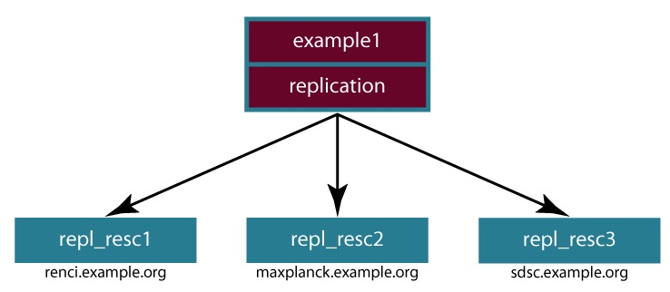

=================================
Enterprise iRODS (E-iRODS) Manual
=================================

.. |todaysdate| date::

:Author: Renaissance Computing Institute (RENCI)
:Version: 3.0beta3
:Date: |todaysdate|

.. contents:: Table of Contents
.. section-numbering::

.. 
..   ----------------
..   ReStructuredText
..   ----------------
.. 
..   Needs python modules::
.. 
..    $ easy_install docutils==0.7.0
..    $ easy_install roman
..    $ easy_install rst2pdf
.. 
..   Some links for learning in place:
.. 
..    http://docutils.sourceforge.net/docs/index.html
.. 
..    http://docutils.sourceforge.net/docs/user/rst/cheatsheet.txt
.. 
..    http://docutils.sourceforge.net/docs/user/rst/quickstart.txt
.. 
..    http://docutils.sourceforge.net/docs/user/rst/quickstart.html
.. 
..    http://docutils.sourceforge.net/docs/user/rst/demo.txt
.. 
..    http://docutils.sourceforge.net/docs/user/rst/demo.html
.. 
..    http://rst2pdf.googlecode.com/svn/trunk/doc/manual.txt
.. 
..   Generate HTML::
.. 
..    $ rst2html.py -stg manual.rst > manual.html
.. 
..   Generate PDF::
.. 
..    $ rst2pdf manual.rst -o manual.pdf

-------------
Release Notes
-------------

.. include:: RELEASE_NOTES

-------
License
-------

.. include:: LICENSE

--------
Overview
--------

This manual attempts to provide standalone documentation for E-iRODS as packaged by the Renaissance Computing Institute (RENCI).

    http://eirods.org

    file:///var/lib/eirods/iRODS/doc/html/index.html

Additional documentation is available on the iRODS wiki and in the two books published by the iRODS team:

    http://irods.org

    http://irods.org/doxygen

    (2010) iRODS Primer: integrated Rule-Oriented Data System (Synthesis Lectures on Information Concepts, Retrieval, and Services)
    http://www.amazon.com/dp/1608453332

    (2011) The integrated Rule-Oriented Data System (iRODS 3.0) Micro-service Workbook
    http://www.amazon.com/dp/1466469129

--------
Download
--------

E-iRODS is currently released in binary form.  Full open source repositories and trackers will be available after the first major release.

RPM and DEB formats are available for both iCAT-enabled servers and resource-only servers.  There are variations available for combinations of platform and operating system.

More combinations will be made available as our testing matrix continues to mature and increase in scope.

The latest files can be downloaded from http://eirods.org/download.

------------
Installation
------------

Installation of the Postgres iCAT DEB::

 $ (sudo) dpkg -i eirods-3.0b3-64bit-icat-postgres.deb
 $ (sudo) apt-get -f install

Installation of the Resource RPM::

 - Make sure to read ./packaging/RPM_INSTALLATION_HOWTO.txt before trying to install the RPM package.
 $ (sudo) rpm -i eirods-3.0b3-64bit-resource.rpm

These packages declare the dependencies necessary to run E-iRODS and if satisfied, they install a service account and group named 'eirods', the E-iRODS binaries, microservice documentation, and this manual.

For the iCAT-enabled server packages, the E-iRODS server and EICAT database are started automatically with default values::

 eirods@hostname:~/ $ ienv
 NOTICE: Release Version = rods3.0, API Version = d
 NOTICE: irodsHost=hostname
 NOTICE: irodsPort=1247
 NOTICE: irodsDefResource=demoResc
 NOTICE: irodsHome=/tempZone/home/rods
 NOTICE: irodsCwd=/tempZone/home/rods
 NOTICE: irodsUserName=rods
 NOTICE: irodsZone=tempZone 

For the resource-only packages, the server is not started automatically.  The administrator will need to run the ./packaging/setup_resource.sh script and provide the following five pieces of information before E-iRODS can start and connect to its configured iCAT Zone:

1) Hostname or IP
2) iCAT Port
3) iCAT Zone 
4) E-iRODS administrator username
5) E-iRODS administrator password

----------
Quickstart
----------

Successful installation will complete and leave a running E-iRODS server.  If you installed an iCAT-enabled E-iRODS server, a database of your choice will also have been created and running.  The iCommand ``ils`` will list your new iRODS administrator's empty home directory in the iRODS virtual filesystem::

 eirods@hostname:~/ $ ils
 /tempZone/home/rods:

When moving into production, you will probably want to cover the next few basic steps:

Changing the administrator account password
-------------------------------------------

The default installation of E-iRODS comes with a single account 'rods' that has rodsadmin privileges and password 'rods'.  You should change the password before letting anyone else onto the system::

 eirods@hostname:~/ $ iadmin moduser rods password <newpassword>

To make sure everything succeeded, you'll need to reauthenticate and check the new connection::
 
 eirods@hostname:~/ $ iinit
 Enter your current iRODS password:
 eirods@hostname:~/ $ ils
 /tempZone/home/rods:

Changing the Zone name
----------------------

The default installation of E-iRODS comes with a Zone named 'tempZone'.  You probably want to change the Zone name to something more domain-specific::

 eirods@hostname:~/ $ iadmin modzone tempZone name <newzonename>
 If you modify the local zone name, you and other users will need to
 change your .irodsEnv files to use it, you may need to update
 irods.config and, if rules use the zone name, you'll need to update
 core.re.  This command will update various tables with the new name
 and rename the top-level collection.
 Do you really want to modify the local zone name? (enter y or yes to do so):y
 OK, performing the local zone rename
 
The Zone has been renamed, but now you will need to update your .irodsEnv file to match (note the three places where the updated zone name is located)::

 eirods@hostname:~/ $ cat .irods/.irodsEnv
 # iRODS server host name:
 irodsHost '<hostname>'
 # iRODS server port number:
 irodsPort 1247
 # Default storage resource name:
 irodsDefResource 'demoResc'
 # Home directory in iRODS:
 irodsHome '/<newzonename>/home/rods'
 # Current directory in iRODS:
 irodsCwd '/<newzonename>/home/rods'
 # Account name:
 irodsUserName 'rods'
 # Zone:
 irodsZone '<newzonename>'

Now, the connection should be reset and you should be able to list your empty iRODS collection again::

 eirods@hostname:~/ $ iinit
 Enter your current iRODS password:
 eirods@hostname:~/ $ ils
 /<newzonename>/home/rods:

Add additional resource(s)
--------------------------

The default installation of E-iRODS comes with a single resource named 'demoResc' which stores its files in the `/var/lib/eirods/iRODS/Vault` directory.  You will want to create additional resources at disk locations of your choosing.  The following command will create a basic 'unix file system' resource at a designated host at the designated fullpath::

 eirods@hostname:~/ $ iadmin mkresc <newrescname> 'unix file system' <fully.qualified.domain.name>:</full/path/to/new/vault>
 
Additional information about creating resources can be found with::

 eirods@hostname:~/ $ iadmin help mkresc
  mkresc Name Type [Host:Path] [ContextString] (make Resource)
 Create (register) a new storage or database resource.

 Name is the name of the new resource.
 Type is the resource type.
 Host is the DNS host name.
 And Path is the defaultPath for the vault.
 ContextString is any contextual information relevant to this resource.
   (semi-colon separated key=value pairs e.g. "a=b;c=d")
  
Creating new resources does not make them default for any existing or new users.  You will need to make sure that default resources are properly set for newly ingested files.

Add additional user(s)
----------------------

The default installation of E-iRODS comes with a single user 'rods' which is a designated 'rodsadmin' type user account.  You will want to create additional 'rodsuser' type user accounts and set their passwords before allowing connections to your new grid::

 eirods@hostname:~/ $ iadmin mkuser <newusername> rodsuser 

 eirods@hostname:~/ $ iadmin lu
 rods#tempZone
 <newusername>#tempZone
 
 eirods@hostname:~/ $ iadmin help mkuser
  mkuser Name[#Zone] Type (make user)
 Create a new iRODS user in the ICAT database

 Name is the user name to create
 Type is the user type (see 'lt user_type' for a list)
 Zone is the user's zone (for remote-zone users)

 Tip: Use moduser to set a password or other attributes,
 use 'aua' to add a user auth name (GSI DN or Kerberos Principal name)

Best practice suggests changing your Zone name before adding new users as any existing users would need to be informed of the new connection information and changes that would need to be made to their local .irodsEnv files.

---------
Upgrading
---------

The beta releases of E-iRODS do not yet support upgrading.  Every install will be a clean install.

This section will be updated when support is included.

------------------------------
Migration from Community iRODS
------------------------------

Support for migrating from Community iRODS is planned, but automated scripts and documentation have not yet been completed.

This section will be updated with support is included and tested.

----------
Backing Up
----------

Backing up E-iRODS consists of three major parts:  The data, the iRODS system and configuration files, and the iCAT database itself.

1) The data itself can be handled by the iRODS system through replication and should not require any specific backup efforts worth noting here.

2) The iRODS system and configuration files can be copied into iRODS as a set of Data Objects by using the `msiServerBackup`_ microservice.  When run on a regular schedule, the `msiServerBackup` microservice will gather and store all the necessary configuration information to help you reconstruct your iRODS setup during disaster recovery.

.. _msiServerBackup: file:///var/lib/eirods/iRODS/doc/html/sys_backup_m_s_8c_abab044dfcae659a200741d4f69999c29.html

3) The iCAT database itself can be backed up in a variety of ways.  A PostgreSQL database is contained on the local filesystem as a data/ directory and can be copied like any other set of files.  This is the most basic means to have backup copies.  However, this will have stale information almost immediately.  To cut into this problem of staleness, PostgreSQL 8.4+ includes a feature called `"Record-based Log Shipping"`__.  This consists of sending a full transaction log to another copy of PostgreSQL where it could be "re-played" and bring the copy up to date with the originating server.  Log shipping would generally be handled with a cronjob.  A faster, seamless version of log shipping called `"Streaming Replication"`__ was included in PostgreSQL 9.0+ and can keep two PostgreSQL servers in sync with sub-second delay.

.. __: http://www.postgresql.org/docs/8.4/static/warm-standby.html#WARM-STANDBY-RECORD
.. __: http://www.postgresql.org/docs/9.0/static/warm-standby.html#STREAMING-REPLICATION

Configuration and maintenance of this type of backup system is out of scope for this document, but is included here as an indication of best practice.

-----------
Assumptions
-----------

.. E-iRODS enforces that the database in use (Postgres, MySQL, etc.) is configured for UTF-8 encoding.  For MySQL, this is enforced at the database level and the table level.  For Postgres, this is enforced at the database level and then the tables inherit this setting.  MySQL is not yet supported with a binary release.

E-iRODS enforces that the database in use (PostgreSQL) is configured for UTF-8 encoding.  This is enforced at the database level and then the tables inherit this setting.

The iRODS setting 'StrictACL' is configured on by default in E-iRODS.  This is different from the community version of iRODS and behaves more like standard Unix permissions.  This setting can be found in the `server/config/reConfigs/core.re` file under acAclPolicy{}.

------------
Architecture
------------

E-iRODS represents a major effort to analyze, harden, and package iRODS for sustainability, modularization, security, and testability.  This has led to a fairly significant refactorization of much of the underlying codebase.  The following descriptions are included to help explain the architecture of E-iRODS.

The core is designed to be as immutable as possible and serve as a bus for handling the internal logic of the business of iRODS (data storage, policy enforcement, etc.).  Exposed by the core will be six or seven major interfaces which will allow extensibility and separation of functionality into plugins.  A few plugins will be included by default in E-iRODS to provide a set of base functionality.

The planned plugin interfaces and their status are listed here:

 ========================   ==========    ========
 Plugin Interface           Status        Since
 ========================   ==========    ========
 Pluggable Microservices    Complete      3.0b2
 Composable Resources       Complete      3.0b3
 Pluggable Authentication   Planned
 Pluggable Database         Planned
 Pluggable Messaging        Planned
 Pluggable RPC API          Planned
 Pluggable Rule Engine      Requested
 ========================   ==========    ========

-----------------------
Pluggable Microservices
-----------------------

E-iRODS is in the process of being modularized whereby existing community iRODS functionality will be replaced and provided by small, interoperable plugins.  The first plugin functionality to be completed was pluggable microservices.  Pluggable microservices allow users to add new microservices to an existing E-iRODS server without recompiling the server or even restarting any running processes.  A microservice plugin contains a single compiled microservice shared object file to be found by the server.  A separate development package, including an example, is available at http://eirods.org/download, and explains how this works in more detail.

--------------------
Composable Resources
--------------------

The second area of modularity to be added to E-iRODS consists of composable resources.  Composable resources replace the concept of resource groups from community iRODS.  There are no resource groups in E-iRODS. 

Tree Metaphor
-------------

Composable resources are best modeled with a tree metaphor (and in computer science parlance, they are tree data structures).  An E-iRODS composable resource is a tree with one 'root' node.  Nodes that are at the bottom of the tree are 'leaf' nodes.  Nodes that are not leaf nodes are 'branch' nodes and have one more more 'child' nodes.  A child node can have one and only one 'parent' node.

The terms root, leaf, branch, child, and parent represent locations and relationships within the structure of a particular tree.  The terms 'coordinating' and 'storage' represent the functionality of particular resources within a particular tree.  A resource node can be a coordinating resource and/or a storage resource.  For clarity and reuse, it is generally best practice to separate the two so that a particular resource node is either a coordinating resource or a storage resource.

In computer science, a tree is a data structure with a hierarchical representation of linked nodes. These nodes can be named based on where they are in the
hierarchy. The node at the top of a tree is the root node. Parent nodes and child nodes are on opposite ends of a connecting link, or edge. Leaf nodes are at
the bottom of the tree, and any node that is not a leaf node is a branch node. These positional descriptors are helpful when describing the structure of a
tree. Composable resources are best represented using this tree metaphor.

Virtualization
--------------

In iRODS, files are stored as Data Objects on disk and have an associated physical path as well as a virtual path within the iRODS file system. iRODS collections only exist in the iCAT database and do not have an associated physical path (allowing them to exist across all resources, virtually).

Composable resources introduce the same dichotomy between the virtual and physical. E-iRODS resources are defined to be either coordinating resources or storage resources. These two different classes of resource map directly to the branch nodes and leaf nodes of a generic tree data structure. A coordinating resource has built-in logic that defines how it determines, or coordinates, the flow of data to and from its children. Coordinating resources exist solely in the iCAT and virtually exist across all E-iRODS servers in a particular Zone. A storage resource has a Vault (physical) path and knows how to speak to a specific type of storage medium (disk, tape, etc.). The encapsulation of resources into a plugin architecture allows E-iRODS to have a consistent interface to all resources, whether they represent coordination or storage.

This virtualization of the coordinating resources allows the logic of how to manage both the placement and the retrieval of Data Objects to exist independent of the types of resources that are connected as children resources. When E-iRODS tries to retrieve data, each child resource will “vote” by offering whether it can provide the requested data, and coordinating resources will decide which particular storage resource (e.g. physical location) the read should come from. The specific manner of this vote is specific to the logic of the coordinating resource. For instance, a coordinating resource could optimize for reducing the number of requests made against each storage resource within some time frame or it could optimize for reducing latency in expected data retrieval times. We expect a wide variety of useful optimizations to be developed by the community.

An intended side effect of the tree metaphor and the virtualization of coordinating resources is the deprecation of the concept of a resource group. Resource groups in community iRODS could not be put into other resource groups. A specific limiting example was that of the compound resource where, by definition, it was a group and could not be placed into another group significantly limiting its functionality as a management tool. Groups in E-iRODS now only refer to user groups.

Read more at `http://eirods.org/release/e-irods-composable-resources/`__:

- `Paper (279kB, PDF)`__
- `Slides (321kB, PDF)`__
- `Poster (6.4MB, PDF)`__

.. __: http://eirods.org/release/e-irods-composable-resources/
.. __: http://eirods.org/dev/wp-content/uploads/2013/02/eirods-composable-resources.pdf
.. __: http://eirods.org/dev/wp-content/uploads/2013/02/eirods-cr-slides.pdf
.. __: http://eirods.org/dev/wp-content/uploads/2013/02/eirods-composable-resources-poster.pdf

Coordinating Resources
----------------------

Coordinating resources contain the flow control logic which determines both how its child resources will be allocated copies of data as well as which copy is returned when a data object is requested.  These include:

- random
- round robin
- pass through (for testing)
- replication (expected)
- load balanced (expected)
- storage balanced (%-full) (expected)
- storage balanced (bytes) (expected)
- tiered (expected)

Storage Resources
-----------------

Storage resources represent storage interfaces and include the file driver information to talk with different types of storage. These include:

- unix file system
- structured file type (tar, zip, gzip, bzip)
- Universal Mass Storage (expected)
- HPSS (expected)
- S3 (expected)
- WOS (expected)
- non-blocking (expected)

Managing Child Resources
------------------------

There are two new ``iadmin`` subcommands introduced with this feature.

``addchildtoresc``::

 eirods@hostname:~$ iadmin h addchildtoresc
  addchildtoresc Parent Child [ContextString] (add child to resource)
 Add a child resource to a parent resource.  This creates an 'edge'
 between two nodes in a resource tree.
  
 Parent is the name of the parent resource.
 Child is the name of the child resource.
 ContextString is any relevant information that the parent may need in order
   to manage the child.

``rmchildfromresc``::

 eirods@hostname:~$ iadmin h rmchildfromresc
  rmchildfromresc Parent Child (remove child from resource)
 Remove a child resource from a parent resource.  This removes an 'edge'
 between two nodes in a resource tree.
  
 Parent is the name of the parent resource.
 Child is the name of the child resource.

Example Usage
-------------

Creating a composite resource consists of creating the individual nodes of the desired tree structure and then connecting the parent and children nodes.

Example 1
*********

   Example 1: Replicates Data Objects to three locations

A replicating coordinating resource with three unix file system storage resources as children would be composed with seven (7) iadmin commands::

 eirods@hostname:~/ $ iadmin mkresc example1 replication
 eirods@hostname:~/ $ iadmin mkresc repl_resc1 "unix file system" renci.example.org:/Vault
 eirods@hostname:~/ $ iadmin mkresc repl_resc2 "unix file system" maxplanck.example.org:/Vault
 eirods@hostname:~/ $ iadmin mkresc repl_resc3 "unix file system" sdsc.example.org:/Vault
 eirods@hostname:~/ $ iadmin addchildtoresc example1 repl_resc1
 eirods@hostname:~/ $ iadmin addchildtoresc example1 repl_resc2
 eirods@hostname:~/ $ iadmin addchildtoresc example1 repl_resc3

-----------------------------
Users & Permissions
-----------------------------

Similar to the way that resources are grouped, users in E-iRODS can also be added to various groups, once the groups have been created. 
A user can belong to more than one group at a time.
The owner of a file has full control of the file and can give/remove access to other users/groups. The owner of a file can also give ownership rights to other users, who in
turn can grant or revoke access to users.

Access to files and collections is modified using ``ichmod`` - the E-iRODS equivalent of the Unix ``chmod`` (change mode) shell command.
Viewing policies for collections can be set in the core.re file by setting the ``msiAclPolicy`` - E-iRODS has strictACL as its default setting.

Collections in E-iRODS have an attribute named Inheritance, which is a directory specific setting.  When Collections have this attribute set to Enabled, new Data Objects and Collections added to the Collection inherit the access permissions (ACLs) of the Collection. Data Objects created within Collections with Inheritance set to Disabled do not inherit the parent Collection's ACL settings.
By default, E-iRODS has Inheritance set to Disabled. 

Inheritance is especially useful when working with shared projects such as a public folder to which all users have read access. With Inheritance set to Enabled, any sub-folders created under the public folder will inherit the properties of the public folder. 
Therefore a user with read access to the public folder will also have read access to all objects and collections created
in the public folder.

--------------------
Rule Engine Syntax
--------------------

The Rule Engine, which interprets rules, is a critical component of the E-iRODS system. Rules are definitions of actions that need to be performed by the server. 
These actions are defined in terms of micro-services and other actions.
The E-iRODS built-in Rule Engine interprets the rules and calls the appropriate micro-services.

A Race condition occurs when two processes occur simultaneously and try to change shared data. The outcome of the process is unpredictable since both threads are "racing" to access/change the data.
To avoid uncertainty in the outcome, the commands ``iput``, ``iget`` and ``irepl`` all have a --wlock/--rlock option to lock the data objects during these operations.
An irodsServer thread then purges unused locked files every 2 hours.

Delay execution
----------------

Rules can be run in two modes- immediate execution or delayed execution. Most of the actions and/or microservices are executed immediately; however some actions are better suited to be placed in a queue and executed later.
The actions and/or microservices which are executed in delay mode are queued and invoked under the ``delayExec`` microservice and their execution is delayed to a later time. Typically, these are resource-heavy, time-intensive
processes, better suited to being carried out in a delayed mode.

One of the issues with delayed execution is that if a particular task fails, the queue starts to increase as scheduled tasks back up.
The following commands may be used to troubleshoot queues that are backed up.

::

	iqdel    - remove a delayed rule (owned by you) from the queue.
	iqmod    - modify certain values in existing delayed rules (owned by you).
	iqstat   - show the queue status of delayed rules.

..
.. ---------------
.. Delay Execution
.. ---------------
.. - how
.. - what
.. - when
.. - where
.. - why
.. - errors
.. - queue management
.. 
.. 
.. ----------
.. Monitoring
.. ----------
.. - nagios plugins (Jean-Yves)
.. - other
.. - Failover checking
.. 

--------------
Authentication
--------------

	E-iRODS uses a secure password system for user authentication. The user passwords are scrambled and stored in the iCAT database.
	Additionally, E-iRODS supports user authentication via PAM (Pluggable Authentication Modules), which in turn can be configured to support Kerberos and LDAP authentication systems.
	To use E-iRODS with PAM, SSL has to be set up between the E-iRODS client and server.

PAM authentication setup
-------------------------	
	#. Add users

		PAM can be configured to to support various authentication systems; however the E-iRODS administrator still needs to add the users to the E-iRODS database. If the user's credentials will be
		exclusively authenticated with PAM, a password need not be assigned.

	
		``iadmin``::

			iadmin mkuser newuser rodsuser

	#. Edit the config file to change the variables as detailed

		``config.mk``::

		
		 # PAM_AUTH = 1 to 

		   PAM_AUTH = 1

		   and 

		 # USE_SSL = 1  to

 		   USE_SSL = 1
		
		and run 'make' again.

	#. Install PAM libraries if needed
		::

 		 sudo apt-get install libpam0g-dev

	   With PAM_AUTH enabled, 'make' will build server/bin/PamAuthCheck from server/auth/src/PamAuthCheck.c. PamAuthCheck.c is a simple program that is run by the irodsAgent to verify the user's password. 
	   PamAuthCheck.c can be adjusted as needed, to use different PAM modules.
	   For PAM Authentication, the iRODS user selects the new iRODS PAM authentication choice (instead of password, or Kerberos) and runs 'iinit' and enters their system password.
	   To protect the system password, SSL (via OpenSSL) is used to encrypt the 'iinit' session.

..
..
..
.. --------------
.. Best Practices
.. --------------
.. - microservice objects (MSO)
.. - tickets
.. - realizable objects (remote database connection)
.. - quota management

-------------
Configuration
-------------

There are a number of configuration files that control how an iRODS server behaves.  The following is a listing of the configuration files in an E-iRODS installation.

This document is intended to explain how the various configuration files are connected, what their parameters are, and when to use them.

~/.odbc.ini
    This file, in the eirods user's home directory, defines the unixODBC connection details needed for the iCommands to communicate with the iCAT database.  This file was created by the installer package and probably should not be changed by the sysadmin unless they know what they are doing.

iRODS/config/irods.config
    This file defines the main settings for the iRODS installation.  It is created by the installer package and comes preconfigured with approved and tested settings.  Changing this file will take effect after a restart of the iRODS server.  It is recommended not to change this file.

iRODS/server/config/server.config
    This file defines the behavior of the server Agent that answers individual requests coming into iRODS.  It is recommended not to change this file.

~/.irods/.irodsA
    This is the scrambled password file that is saved after an ``iinit`` is run.  If this file does not exist, then each iCommand will prompt for a password before authenticating with the iRODS server.  If this file does exist, then each iCommand will read this file and use the contents as a cached password token and skip the password prompt.  This file can be deleted manually or can be removed by running ``iexit full``.

~/.irods/.irodsEnv
    This is the main iRODS configuration file defining the iRODS environment.  Any changes are effective immediately since iCommands reload their environment on every execution.

-----------------------
Troubleshooting
-----------------------
 
Common Errors
-------------

Some of the commonly encountered E-iRODS errors along with troubleshooting steps are discussed below.	

#. **E-iRODS Server is down**	

	Error Code: USER_SOCK_CONNECT_TIMEDOUT	-347000

	Common areas to check for this error include:

	**ienv**
		The ienv command verifies the E-iRODS environment for the server

	**Networking issues**

	- Verify that a firewall is not blocking the connection on the E-iRODS port in use.
	
	- Check for network connectivity problems by pinging the server in question.

	**E-iRODS server logs**
		If the E-iRODS environment issues and networking issues have been ruled out, the E-iRODS server/client logs may provide information on the server status.

#. **No such file or directory**

	Common areas to check for this error include:

	**Permissions**
		Verify that the E-iRODS user has 'write' access to the directory in question.

	**FUSE error**

	**Zero byte files**

#. **No rows found in the E-iRODS Catalog**

	Error Code: CAT_NO_ROWS_FOUND	-808000

	The CAT_NO_ROWS_FOUND error is encountered when there are no results for the  query that was executed. This can happen because 

	- the query itself is framed incorrectly or 

	- there truly are no results for the query i.e. there is no data corresponding to the criteria specified.

#. **Access control/Permissions**

	Error Code: CAT_NO_ACCESS_PERMISSION		-818000

	This error can occur when a user tries to get or put a file that belongs to another user without the file owner having given read and/or write permission.
	A more restrictive policy on viewing collections can be set in the core.re file - ``msiAclPolicy("STRICT")``. In this mode, the user will not even be able to see the file.
	In a non-strict mode, the user would be able to see the file; however read/write permissions determine what the user can do with the file.
 	
	Modifying the core.re file will apply the policy permanently; applying the policy via ``irule`` will have an impact only during the execution of the rule.

#. **Credentials**

	Error Code: CAT_INVALID_USER	-827000
	
	This error can occur when the user is unknown or invalid in some way (for instance- no password has been defined for the user).

--------
Glossary
--------

This glossary attempts to cover most of the terms you may encounter when first interacting with iRODS.  More information can be found on the iRODS wiki at http://irods.org.

Action
    An external (logical) name given to an iRODS Rule(s) that defines a set of macro-level tasks.
    These tasks are performed by a chain of microservices in accordance with external input parameters.
    This is analogous to head atom in a Prolog rule or trigger-name in a relational database.

Agent
    A type of iRODS server process.  Each time a client connects to a server, an agent is created and a network connection established between it and the client.

API
    An Application Programming Interface (API) is a piece of software's set of defined programmatic interfaces to enable other software to communicate with it.  iRODS defines a client API and expects that clients connect and communicate with iRODS servers in this controlled manner.  iRODS has an API written in C, and another written in Java (Jargon). 

Authentication Mechanisms
    iRODS can employ various mechanisms to verify user identity and control access to Data Objects (iRODS files), Collections, etc.  These currently include the default iRODS secure password mechanism (challenge-response), Grid Security Infrastructure (GSI), and Operating System authentication (OSAuth).

Audit Trail
    List of all operations performed upon a Data Object, a Collection, a Resource, a User, or other iRODS entities.  When Auditing is enabled, significant events in the iRODS system (affecting the iCAT) are recorded.  Full activity reports can be compiled to verify important preservation and/or security policies have been enforced.

Client
    A Client in the iRODS client-server architecture gives users an interface to manipulate Data Objects and other iRODS entities that may be stored on remote iRODS servers. iRODS clients include: iCommands unix-like command line interface, iDrop (ftp-like client java application), iDropWeb (web interface), etc.

Collection
    All Data Objects stored in an iRODS system are stored in some Collection, which is a logical name for that set of Data Objects. A Collection can have sub-collections, and hence provides a hierarchical structure. An iRODS Collection is like a directory in a Unix file system (or Folder in Windows), but is not limited to a single device or partition. A Collection is logical so that the Data Objects can span separate and heterogeneous storage devices (i.e. is infrastructure and administrative domain independent). Each Data Object in a Collection must have a unique name in that Collection.

Data Grid
    A grid computing system (a set of distributed, cooperating computers) that deals with the controlled sharing and management of large amounts of distributed data.

Data Object
    A Data Object is a single "stream-of-bytes" entity that can be uniquely identified; a file stored in iRODS. It is given a Unique Internal Identifier in iRODS (allowing a global name space), and is associated with (situated in) a Collection.

Driver
    A piece of software that interfaces to a particular type of resource as part of the iRODS server/agent process. The driver provides a common set of functions (open, read, write, close, etc.) which allow iRODS clients (iCommands and other programs using the client API) to access different devices via the common iRODS protocol.

Federation
    Zone Federation occurs when two or more independent iRODS Zones are registered with one another.  Users from one Zone can authenticate through their home iRODS server and have access rights on a remote Zone and its Data Objects, Collections, and Metadata.

Jargon
    The Java API for iRODS.  Read more at https://www.irods.org/index.php/Jargon.
iCAT
    The iCAT, or iRODS Metadata Catalog, stores descriptive state metadata about the Data Objects in iRODS Collections in a DBMS database (e.g. PostgreSQL, MySQL, Oracle). The iCAT can keep track of both system-level metadata and user-defined metadata.  There is one iCAT database per iRODS Zone.

IES (iCAT-Enabled Server)
    A machine that runs both an iRODS server and the iCAT database for a particular Zone.

iCommands
    iCommands are Unix utilities that give users a command-line interface to operate on data in the iRODS system. There are commands related to the logical hierarchical filesystem, metadata, data object information, administration, rules, and the rule engine. iCommands provide the most comprehensive set of client-side standard iRODS manipulation functions.

Inheritance
    Collections in the iRODS logical name space have an attribute named Inheritance.  When Collections have this attribute set to Enabled, new Data Objects and Collections added to the Collection inherit the access permissions (ACLs) of the Collection. Data Objects created within Collections with Inheritance set to Disabled do not inherit the parent Collection's ACL settings.  ``ichmod`` can be used to manipulate this attribute on a per-Collection level.  ``ils -A`` displays ACLs and the inheritance status of the current working iRODS directory.

Logical Name
    The identifier used by iRODS to uniquely name a Data Object, Collection, Resource, or User. These identifiers enable global namespaces that are capable of spanning distributed storage and multiple administrative domains for shared Collections or a unified virtual Collection.

Management Policies
    The specification of the controls on procedures applied to Data Objects in a Collection. Management policies may define that certain Metadata be required to be stored.  Those policies could be implemented via a set of iRODS Rules that generate and verify the required Metadata.  Audit Trails could be used to generate reports that show that Management Policies have been followed.

Metadata
    Metadata is data about data.  In iRODS, metadata can include system or user-defined attributes associated with a Data-Object, Collection, Resource, etc., stored in the iCAT database.  The metadata stored in the iCAT database are in the form of AVUs (attribute-value-unit tuples).

Metadata Harvesting
    The process of extraction of existing Metadata from a remote information resource and subsequent addition to the iRODS iCAT.  The harvested Metadata could be related to certain Data Objects, Collections, or any other iRODS entity.

Micro-service
    A set of operations performed on a Collection at a remote storage location. 

    Micro-services are small, well-defined procedures/functions that perform a certain server-side task and are compiled into the iRODS server code. Rules invoke Micro-services to implement Management Policies.  Micro-services can be chained to implement larger macro-level functionality, called an Action. By having more than one chain of Micro-services for an Action, a system can have multiple ways of performing the Action. At runtime, using priorities and validation conditions, the system chooses the "best" micro-service chain to be executed. 

Migration
    The process of moving digital Collections to new hardware and/or software as technology evolves.  Separately, Transformative Migration may be used to mean the process of manipulating a Data Object into a new format (e.g. gif to png) for preservation purposes.

Physical Resource
    A storage system onto which Data Objects may be deposited. iRODS supports a wide range of disk, tape, and remote storage resources.

Resource
    A resource, or storage resource, is a software/hardware system that stores digital data. iRODS clients can operate on local or remote data stored on different types of resources through a common interface.

Rules
    Rules are a major innovation in iRODS that let users automate data management tasks, essential as data collections scale to petabytes across hundreds of millions of files. Rules allow users to automate enforcement of complex Management Policies (workflows), controlling the server-side execution (via Micro-services) of all data access and manipulation operations, with the capability of verifying these operations.

Rule Engine
    The Rule Engine interprets Rules following the iRODS rule syntax. The Rule Engine, which runs on all iRODS servers, is invoked by server-side procedure calls and selects, prioritizes, and applies Rules and their corresponding Micro-services. The Rule Engine can apply recovery procedures if a Micro-service or Action fails.

Scalability
    Scalability means that a computer system performs well, even when scaled up to very large sizes.  In iRODS, this refers to its ability to manage Collections ranging from the data on a single disk to petabytes (millions of gigabytes) of data in hundreds of millions of files distributed across multiple locations and administrative domains.

Server
    An iRODS server is software that interacts with the access protocol of a specific storage system.  It enables storing and sharing data distributed geographically and across administrative domains.

Transformative Migration
    The process of manipulating a Data Object from one encoding format to another.  Usually the target format will be newer and more compatible with other systems.  Sometimes this process is "lossy" and does not capture all of the information in the original format.

Trust Virtualization
    The management of Authentication and authorization independently of the storage location.

Unique Internal Identifier
    See Logical Name. 

User Name
    Unique identifier for each person or entity using iRODS; sometimes combined with the name of the home iRODS Zone (as username#Zonename) to provide a globally unique name when using Zone Federation.

Vault
    An iRODS Vault is a data repository system that iRODS can maintain on any storage system which can be accessed by an iRODS server. For example, there can be an iRODS Vault on a Unix file system, an HPSS (High Performance Storage System), or an IBM DB2 database. A Data Object in an iRODS Vault is stored as an iRODS-written object, with access controlled through the iCAT catalog. This is distinct from legacy data objects that can be accessed by iRODS but are still owned by previous owners of the data. For file systems such as Unix and HPSS, a separate directory is used; for databases such as Oracle or DB2 a system-defined table with LOB-space (Large Object space) is used. 

Zone
    An iRODS Zone is an independent iRODS system consisting of an iCAT-Enabled Server (IES), optional additional distributed iRODS Servers (which can reach hundreds, worldwide) and clients. Each Zone has a unique name. When two iRODS Zones are configured to interoperate with each other securely, it is called (Zone) Federation.

------------
Known Issues
------------

.. include:: KNOWN_ISSUES
    :literal:

-------------------
History of Releases
-------------------

==========   =======    =====================================================
Date         Version    Description
==========   =======    =====================================================
2013-03-15   3.0b3      Third Beta Release.
                          This is the third release from RENCI.  It includes
                          a new package for CentOS 6+, support for composable
                          resources, and additional documentation.
2012-06-25   3.0b2      Second Beta Release.
                          This is the second release from RENCI.  It includes
                          packages for iCAT, Resource, iCommands, and
                          development, in both DEB and RPM formats.
                          Also includes more documentation.
2012-03-01   3.0b1      Initial Beta Release.
                          This is the first release from RENCI, based on the
                          iRODS 3.0 community codebase.
==========   =======    =====================================================

